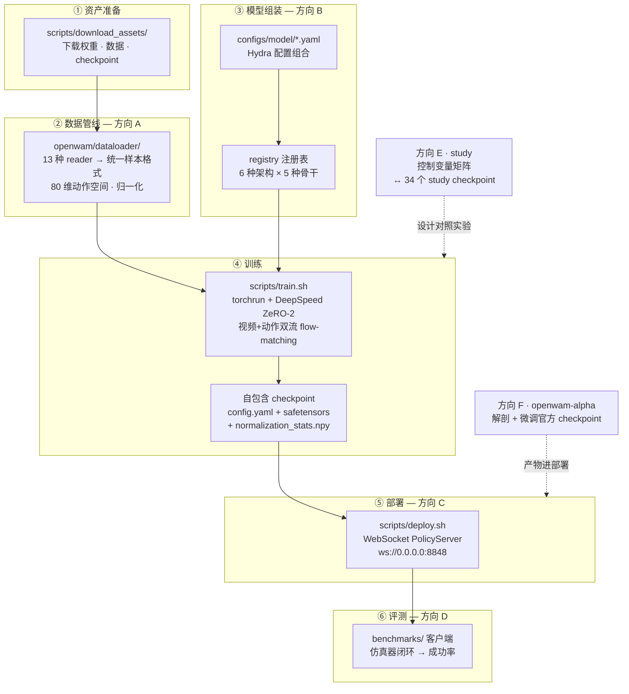
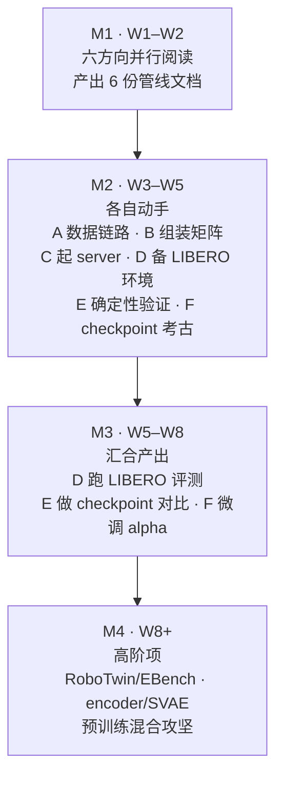

# OpenWAM 调研任务书（总索引）

> 分析对象：`OpenWAM-Official/OpenWAM` @ `main` `90e94ae`（行号以此为准）
> 本文档是入口：读 §1 了解仓库，看 §2 的端到端全景图，按 §3 选方向，然后进入对应方向文档。
> 文中所有路径均为 OpenWAM 仓库（`OpenWAM/`）下的相对路径。

---

## 1. 仓库速览

**OpenWAM** 是一个 World–Action Model（WAM）系统预训练研究栈（论文 arXiv:2609.07398，Apache-2.0），由三部分组成：

- **OpenWAM-Infra**：模块化基础设施。模型（架构 × 骨干）、训练、部署、评测全部可组合替换。
- **OpenWAM-Study**：受控消融实验体系。官方发布了 34 个 study checkpoint。
- **OpenWAM-α**：预训练基础模型。518.5M 帧（约 6400 小时）egocentric human + robot 数据，14 个 alpha checkpoint 发布在 HuggingFace。

---

## 2. 端到端复现主干

一次完整复现要走的六个阶段，以及每个阶段的归属方向：



两点说明：

- **方向 E 和 F 不在主链上，而是横切**：E 管"怎么设计受控对照实验"（作用于训练阶段），F 管"alpha 这个具体模型是什么"（它的 checkpoint 直接进入部署）。
- **训练没有单独设方向**：模型怎么组装归 B，对照实验怎么跑归 E，alpha 微调归 F。

---

## 3. 六个方向

| 方向 | 文档 | 研究问题 | 何时需要什么资源 | 跨方向依赖 |
|---|---|---|---|---|
| **A** | [方向A-Data-Infra数据管线.md](方向A-Data-Infra数据管线.md) | 数据管线如何搭建：13 种异构数据统一成一种训练样本 | 前两周零依赖；之后 CPU + LIBERO（1.9GB） | 无 |
| **B** | [方向B-Model-Infra模型管线.md](方向B-Model-Infra模型管线.md) | 模型模块化管线如何搭建：yaml 经 registry 组装出架构 × 骨干 | 前两周零依赖；之后仅 CPU（mock backbone） | 无 |
| **C** | [方向C-Deployment-Infra部署管线.md](方向C-Deployment-Infra部署管线.md) | 部署管线如何搭建：自包含 checkpoint 变成 WebSocket 服务 | 前两周零依赖；之后 1 张 ≥24GB GPU + 1 个 checkpoint | 无 |
| **D** | [方向D-Evaluation-Infra评测管线.md](方向D-Evaluation-Infra评测管线.md) | 评测管线如何搭建：薄客户端 + 厚服务端，8 个 benchmark | 前两周零依赖；评测阶段需方向 C 的 server + 各仿真器环境 | C |
| **E** | [方向E-Study消融实验实现.md](方向E-Study消融实验实现.md) | 受控消融如何实现：实验矩阵、训练确定性、对照方法论 | 前两周零依赖；E3 对比评测时借方向 C/D 的设施 | C/D（仅 E3） |
| **F** | [方向F-OpenWAM-Alpha模型实现.md](方向F-OpenWAM-Alpha模型实现.md) | α 模型如何实现：配置链、80 维契约、预训练配方、微调路径 | 前两周零依赖；checkpoint 考古只需 CPU；微调需 4×80GB | C（仅 F5） |

**工作方式**：

1. **前两周（W1–W2）全员纯阅读 + 写文档**。每个方向的第一批任务只要求读代码、画调用链、写管线搭建文档，不需要 GPU，不需要装环境，今天就能开工。
2. **环境各管各的**。每个方向文档的 §0 写清了它自己需要什么资源、哪个阶段需要、怎么获取。没有"全组统一搭环境"这个环节，谁也不会被别人卡住。
3. 建议一人一个方向（人少可合并 A+F、B+E）。W2 结束各自讲一遍自己的管线，拼出全图。

---

## 4. 排期建议（估计）



跨方向硬依赖只有三处，且全部出现在 M2 之后：D 评测需要 C 的 server；F5 冒烟需要 C 的 server；E3 对比评测需要 C+D。

---

## 5. 风险登记册

| # | 风险/缺口 | 影响 | 归属方向 |
|---|---|---|---|
| R1 | **预训练数据混合不完整**：egocentric human（EgoDex/Ego4D）reader 未发布（`openwam/dataloader/registry.py:91-106` 无注册，仅 docstring 残留）；`configs/dataloader/pretrain_data/` 全是 `/path/to` 占位 | OpenWAM-α 从头预训练**不可完整复现** | A（A7）/ F（F3） |
| R2 | LAPA/latent-action 工具链缺席（README 提及，代码零命中，已核验） | latent action 方向无仓库支撑 | B |
| R3 | 算力门槛：训练最低 4×80GB（2 卡 OOM 有官方记录） | 重训类任务需专项申请 | F / E |
| R4 | CI 无 GPU/模型覆盖（`.github/workflows/ci.yml` 仅 CPU torch） | "CI 绿" ≠ "复现可行" | 全员 |
| R5 | 文档/代码不一致多处：`project.output_dir`、`--state-dim`、`attention_mask_mode` 默认值 | 按文档操作会踩坑；以代码与 checkpoint 内 `config.yaml` 为准 | B / C / F |
| R6 | EBench 的 Isaac Sim 4.1.0 不支持 Blackwell GPU | D5 完整评测需先核对 GPU 代际 | D |
| R7 | RoboTwin prompt 模板双份维护（`benchmarks/robotwin/prompt_template.py` ↔ `openwam/dataloader/transforms/multiview.py`，靠测试钉住逐字节一致） | 单侧改动 → 静默分布偏移 | D / A |
| R8 | EGL×CUDA 驱动冲突（MuJoCo 系 benchmark，exit=-6） | 评测进程随机崩溃；用 `--render-gpus` 隔离 | D |
| R9 | Cosmos 路线需 submodule（当前为空）+ 编译 transformer-engine；DINOv3/FLUX.2 为 HF gated | 相关任务启动前一周发起授权/下载 | B |
| R10 | `Wan21` 一个类注册两个名字，加载由 `model_path` 决定，失配仅 WARN | 静默加载错骨干 | B / F |

各方向文档的 §6 有展开说明和代码锚点。

---

## 6. 命令速查

```bash
# ---- 环境（Native 路线；Docker 路线见方向C §0）----
conda create -n openwam python=3.10 && conda activate openwam
pip install torch==2.7.1 torchvision==0.22.1 torchaudio==2.7.1 \
  --index-url https://download.pytorch.org/whl/cu128
pip install -e '.[dev]'               # deepspeed 现场编译需 gcc

# ---- 测试门禁（各方向共用的最低验证）----
make test                             # CPU 核心集（CI 等价）

# ---- 资产下载（均有 --name/--yes 非交互模式）----
python scripts/download_assets/download_video_backbone.py       # Wan2.2-TI2V-5B 等
python scripts/download_assets/download_benchmark_data.py       # LIBERO 等（自动建 stats+回写 yaml）
python scripts/download_assets/download_openwam_checkpoints.py  # alpha 14 + study 34
python scripts/download_assets/download_vlm_backbone.py         # tri_system 专用
python scripts/download_assets/download_visual_encoder.py       # DINOv3/V-JEPA/VAE

# ---- 训练 ----
bash scripts/train.sh dataloader=libero model=dual_system \
  model/video_backbone=wan22_ti2v_5b model.architecture.variant=joint_self_attn \
  model.architecture.attention_mask_mode=mutual training.debug=true   # 20 步冒烟
bash scripts/train.sh dataloader=libero \
  training.finetune_ckpt_path=<foundation_ckpt_dir>                   # α 微调

# ---- 部署与推理 ----
bash scripts/deploy.sh <ckpt_dir>     # ws://0.0.0.0:8848
python scripts/inference_test/inference_single_test.py --server ws://127.0.0.1:8848 --test --state-dim <N>

# ---- Cosmos 可选依赖（方向B 相关任务才需要）----
git submodule update --init third_party/cosmos-predict2.5
bash scripts/install_cosmos_predict25.sh   # 需 nvcc + cuDNN
```

**仓库内权威文档**：

- `assets/openwam_usage_docs/train-and-deploy.md` — 训练与部署
- `assets/openwam_usage_docs/architecture-extension.md` — 架构/骨干扩展约定（方向B B-4 的依据）
- `assets/openwam_usage_docs/benchmark-integration.md` — benchmark/dataloader 接入（方向A A5 的依据）
- `assets/openwam_usage_docs/openwam-alpha-finetuning.md` — α 微调（方向F F2 的权威来源）
- `assets/openwam_usage_docs/docker.md` — Docker/离线部署（方向C C7）
- `benchmarks/README.md` — 客户端接入总指南（方向D D1）
- `benchmarks/{robotwin,libero}/LABTASKER.md` — Labtasker 分布式评测

---

## 7. 附：调研方法

本任务书基于对仓库的 8 路并行只读调研（架构/骨干/训练/数据/部署/评测/基建/测试），关键结论经源码交叉核验（LAPA 缺席、EgoDex reader 缺席、mask 默认值不一致等均经 grep 复核）。完整版单文档见 main 分支 `OpenWAM调研方向分配与任务书.md`（含速查表全集）。
