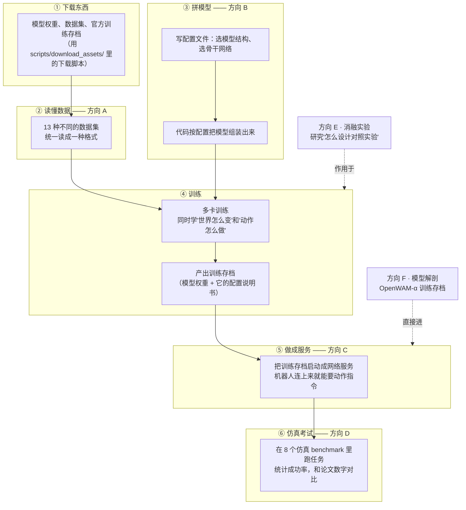

# OpenWAM 调研任务书

> 这份文档带大家拆解 OpenWAM 仓库：它是干什么的、怎么跑起来、每个人负责看懂哪一块。
> 分析对象：OpenWAM-Official/OpenWAM 的 main 分支（提交 `90e94ae`，文中行号以此为准）。

---

## 这份任务书的目标

**最终任务**：学习结束后，组里每个人能独立做到四件事——

1. **搭建 infra**：数据、模型、部署、评测四条管线，每条都能从零搭起来（能新接一个数据集、新加一个模型组件、新起一个服务、新接入一个考场）；
2. **设计消融**：会按"每次只改一个变量"的规矩设计并执行对照实验；
3. **训练**：能跑通从头训练，也能基于官方存档做微调；
4. **部署与评测**：能把训练存档做成网络服务，并在仿真考场里复现论文的成功率。

**阶段性任务**（按顺序推进，每段都有明确产出）：

| 阶段 | 做什么 | 产出 |
|---|---|---|
| 一（第 1–2 周） | 六个方向并行：读代码、写管线讲解、各完成一个动手建造物 | 6 份管线文档；A 的新数据集类型、B 的新模型组件、C 的可请求服务、D 的评测管线总图、E 的可复现验证、F 的存档解剖报告 |
| 二（第 3–5 周） | 各自动手复现：A 跑通数据链路、B 拼模型做组装实验、C 把服务搭起来、D 装好 LIBERO 考场、E 验证实验可复现、F 解剖官方存档 | 服务可用 + LIBERO 考场就绪 |
| 三（第 5–8 周） | 汇合产出：跑评测、做对比、微调 α | LIBERO 成功率对照表 + 一组官方实验模型对比 + α 微调存档 |
| 四（第 8 周以后） | 啃硬骨头 | RoboTwin/EBench 大评测、外接编码器/SVAE、预训练混合攻坚 |

方向之间只有三处需要等别人，且都在第二阶段以后：D 正式评测要等 C 的服务；F 的第 5 个任务要等 C 的服务；E 的第 3 个任务要借 C 和 D 的设施。

---

## 这个仓库是干什么的

OpenWAM 是一个训练"机器人世界模型"的开源项目。它想让模型做两件事：先看懂世界怎么变化（输入视频），再决定机器人该怎么动（输出动作）。仓库里有三样东西：

- **一套积木式框架**：模型、训练、部署、评测都做成了可替换的模块。想换模型结构、换数据集、换评测环境，改配置就行，不用改代码。
- **一批官方消融实验**：官方通过"每次只改一个变量"的对比实验，总结了一套设计经验，并发布了 34 个实验模型文件（叫 study checkpoint）。
- **一个官方训练好的大模型 OpenWAM-α**：用了 518.5M 帧视频（约 6400 小时，包含人拍的第一视角视频和机器人数据）训练，14 个模型文件挂在 HuggingFace 上，可以直接下载来用或继续微调。

论文在 arXiv:2609.07398，代码是 Apache-2.0 协议。

---

## 整个复现流程长什么样

把 OpenWAM 跑起来一共六步，每一步对应一个方向（图里标了归属）：



两个方向的定位比较特殊：

- **方向 E（消融实验）不在这条链上**。它研究的是方法论：官方那 34 个对比实验是怎么设计的，我们怎么照做。
- **方向 F（模型解剖）可以跳过训练**。官方模型文件直接下载就能进第⑤步部署，不用自己训。

训练没有单独设方向：模型怎么拼装归 B，对照实验怎么跑归 E，α 微调归 F。

---

## 六个方向，一人一个

| 方向 | 文档 | 一句话说明 | 什么时候开始需要资源 |
|---|---|---|---|
| **A** | [方向A-数据管线.md](方向A-数据管线.md) | 搞懂 13 种机器人数据集是怎么被读进来、统一成训练样本的 | 前两周零依赖；之后一台普通电脑 + 下载 LIBERO 数据（1.9GB） |
| **B** | [方向B-模型管线.md](方向B-模型管线.md) | 搞懂模型是怎么"拼"出来的：一份配置文件如何变成一个可训练的模型 | 前两周零依赖；之后普通电脑就能做实验（代码里有假模型可以替代真权重） |
| **C** | [方向C-部署管线.md](方向C-部署管线.md) | 搞懂训练存档怎么变成一个网络服务，让机器人来问"下一步怎么动" | 前两周零依赖；之后要 1 张 24GB 以上的显卡 + 下载一个官方存档（约 25GB） |
| **D** | [方向D-评测管线.md](方向D-评测管线.md) | 搞懂 8 个仿真考试是怎么跑的，把论文里的成功率复现出来 | 前两周零依赖；正式评测需要方向 C 先把服务搭好 |
| **E** | [方向E-消融实验.md](方向E-消融实验.md) | 搞懂官方的对照实验是怎么设计的，学会照规矩做对比 | 前两周零依赖；做对比评测时借用方向 C/D 的设施 |
| **F** | [方向F-模型解剖.md](方向F-模型解剖.md) | 把官方大模型 α 拆开看清楚：里面装了什么、按什么规矩训练的、怎么微调 | 前两周零依赖；解剖存档用普通电脑就行；微调要 4 张 80GB 显卡 |

人少可以合并：A+F 一组，B+E 一组。

---

## 容易踩的坑（全组共用）

| # | 坑 | 后果 | 怎么办 |
|---|---|---|---|
| 1 | **官方没发布"人视角视频"那部分数据的读取代码**（代码里只剩注释痕迹）。α 预训练用了 518.5M 帧，但仓库里的配方只能覆盖机器人那部分 | α 从头预训练**无法完整复现** | 以"下载官方存档再微调"为主路线；方向 A/F 会把这个缺口调查清楚 |
| 2 | 训练很吃显卡：官方记录 2 张 80GB 卡在第一步就爆显存 | 低于 4 张 80GB 跑不动正式训练 | 重训类任务提前申请算力；平时用"微调"和"小模型"路线 |
| 3 | 文档和代码有几处对不上（输出目录参数名、state 维度、注意力掩码默认值） | 照文档操作会报错 | 一律以代码和训练存档里的配置为准，各方向文档里已标出具体位置 |
| 4 | 仿真器（MuJoCo）和 CUDA 驱动会打架，考试进程会莫名崩溃 | 评测跑到一半挂掉 | 用 `--render-gpus` 把渲染和推理分到不同显卡上（方向 D 文档有具体操作） |
| 5 | EBench 用的 Isaac Sim 4.1.0 不支持最新的 Blackwell 显卡 | 新卡机器上这个考试跑不了 | 做 EBench 之前先查显卡型号（方向 D 文档有说明） |
| 6 | Cosmos 系列骨干网络需要额外编译组件；DINOv3/FLUX.2 的权重需要先申请授权 | 相关任务会卡住 | 提前一周发起下载和授权申请（方向 B 文档有清单） |

每个方向文档的最后一节还有该方向专属的踩坑清单。

---

## 常用命令

```bash
# 装环境（普通 Python 路线）
conda create -n openwam python=3.10 && conda activate openwam
pip install torch==2.7.1 torchvision==0.22.1 torchaudio==2.7.1 \
  --index-url https://download.pytorch.org/whl/cu128
pip install -e '.[dev]'

# 跑测试（不需要 GPU，装完环境先跑这个确认没问题）
make test

# 下载东西（每个脚本都有交互菜单，跟着选就行）
python scripts/download_assets/download_video_backbone.py       # 模型骨干权重
python scripts/download_assets/download_benchmark_data.py       # 各 benchmark 数据集
python scripts/download_assets/download_openwam_checkpoints.py  # 官方训练存档
python scripts/download_assets/download_vlm_backbone.py         # 三系统架构才需要的语言模型
python scripts/download_assets/download_visual_encoder.py       # 外部视觉编码器

# 训练（先跑 20 步的调试模式，确认能跑通再正式训）
bash scripts/train.sh dataloader=libero model=dual_system \
  model/video_backbone=wan22_ti2v_5b model.architecture.variant=joint_self_attn \
  model.architecture.attention_mask_mode=mutual training.debug=true

# 微调官方模型
bash scripts/train.sh dataloader=libero \
  training.finetune_ckpt_path=<官方存档目录>

# 把训练存档做成服务，然后发一个测试请求
bash scripts/deploy.sh <存档目录>
python scripts/inference_test/inference_single_test.py --server ws://127.0.0.1:8848 --test --state-dim <维度>
```

**仓库自带的官方文档**（在 `assets/openwam_usage_docs/` 和 `benchmarks/` 下）：

- `train-and-deploy.md`：怎么训练、怎么部署
- `architecture-extension.md`：怎么给框架加新的模型组件（方向 B 要用）
- `benchmark-integration.md`：怎么接入新的数据集和 benchmark（方向 A 要用）
- `openwam-alpha-finetuning.md`：α 微调的官方说明（方向 F 的必读）
- `docker.md`：Docker 安装和离线部署（方向 C 要用）
- `benchmarks/README.md`：评测客户端总指南（方向 D 的必读）

---

## 这份任务书是怎么来的

对仓库做了 8 路并行代码调研（模型结构、骨干网络、训练、数据、部署、评测、基础设施、测试），关键结论都经过源码核对（比如"官方没发布人视角数据读取代码"这条，是全局搜索验证过的）。单文件完整版见 main 分支 `OpenWAM调研方向分配与任务书.md`。
