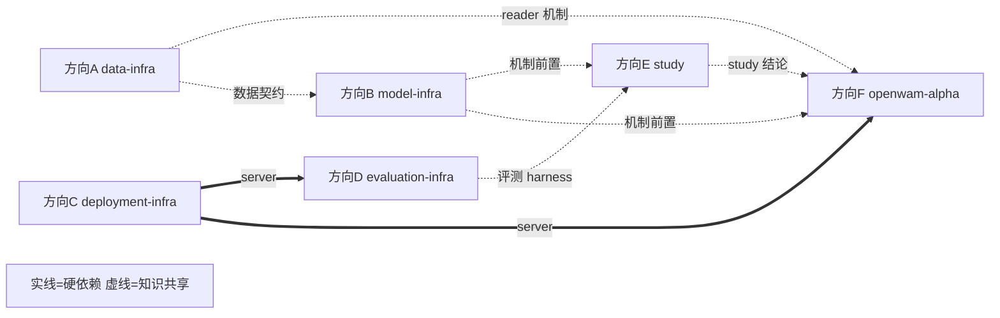

# OpenWAM 调研任务书（总索引）

> 版本：v2.0（2026-09-23，六管线重组版）｜分析对象：`OpenWAM-Official/OpenWAM` @ `main` `90e94ae`
> 本文档是入口：先读 §1 了解仓库与组织理念，§2 选方向，再进入对应方向文档。
> 文中所有路径均为 OpenWAM 仓库（`OpenWAM/`）下的相对路径，行号以 `90e94ae` 为准。

---

## 1. 仓库一分钟速览与组织理念

**OpenWAM** 是一个 World–Action Model（WAM）系统预训练研究栈（论文 arXiv:2609.07398，Apache-2.0），由三部分组成：

- **OpenWAM-Infra**：模块化基础设施——模型（架构×骨干）、训练、推理部署、评测全部可组合替换；
- **OpenWAM-Study**：受控消融实验体系（官方发布 34 个 study checkpoint）；
- **OpenWAM-α**：518.5M 帧（约 6400 小时）egocentric human + robot 数据上预训练的开放基础模型（14 个 alpha checkpoint 发布在 HuggingFace）。

**为什么按六条管线拆分**：第一版方案把环境搭建设为全组公共前置（方向 A），一旦环境卡住，所有人都无法开工。本版改为**六条各自独立的管线调研方向**：

1. **第一阶段（W1–W2）全员纯阅读 + 文档化**：每个方向的第一批任务只需要读代码和写文档，**零 GPU、零环境依赖**，随时开工；
2. **每个方向自带"最小环境路径"**（见各文档 §0）：需要什么权重/数据/卡、什么时候需要，精确到下载命令，不再有"全组统一大环境"这个阻塞点；
3. 跨方向硬依赖只剩三处（见 §3 依赖图），其余全部并行。

**端到端复现主干**（六个方向各管一段）：

```
data-infra(A)      model-infra(B)        deployment-infra(C)     evaluation-infra(D)
下载器+reader ──→ Hydra 组合+registry ──→ checkpoint+WS server ──→ benchmark 客户端
                         │                                              ↑
              study(E)：控制变量矩阵 ←────── openwam-alpha(F)：具体模型 artifact
```

---

## 2. 方向总表（点进对应文档）

| 方向 | 文档 | 研究问题 | 动手起点 | 外部依赖 |
|---|---|---|---|---|
| **A** | [方向A-Data-Infra数据管线.md](方向A-Data-Infra数据管线.md) | 数据管线如何搭建：13 种异构数据 → 一种训练样本 | 读代码 → CPU + LIBERO(1.9GB) | 无 |
| **B** | [方向B-Model-Infra模型管线.md](方向B-Model-Infra模型管线.md) | 模型模块化管线如何搭建：yaml → registry → 架构×骨干 | 读代码 → CPU（mock backbone） | 无 |
| **C** | [方向C-Deployment-Infra部署管线.md](方向C-Deployment-Infra部署管线.md) | 部署管线如何搭建：自包含 checkpoint → WebSocket server | 读代码 → 1×≥24GB GPU + 1 checkpoint | 无 |
| **D** | [方向D-Evaluation-Infra评测管线.md](方向D-Evaluation-Infra评测管线.md) | 评测管线如何搭建：薄客户端+厚服务端，8 大 benchmark | 读代码 → 方向C的 server + 各仿真器 env | C（仅评测阶段） |
| **E** | [方向E-Study消融实验实现.md](方向E-Study消融实验实现.md) | 受控消融如何实现：实验矩阵、确定性、对照方法论 | 读代码 → CPU；对比评测时借 C/D | C/D（仅 E3） |
| **F** | [方向F-OpenWAM-Alpha模型实现.md](方向F-OpenWAM-Alpha模型实现.md) | α 模型实现：配置链、80 维契约、预训练配方、微调路径 | 读代码 → 1 checkpoint 考古（CPU 可） | C（仅 F5） |

**建议分工**（6 人最佳；人少可合并 A+F、B+E）：每人一条管线，W1–W2 各自产出管线搭建文档后组内互讲。

---

## 3. 依赖关系与里程碑（估计）



> 硬依赖只有：D 需要 C 的 server（评测阶段）、F5 需要 C 的 server、E3 需要 C+D。全部在第二阶段才出现。

| 阶段 | 周（估计） | 全员动作 | 里程碑产出 |
|---|---|---|---|
| M1 | W1–W2 | 六方向并行纯阅读：各自完成"管线搭建文档"（各文档 §4 的前 1–2 个任务） | 6 份管线文档 + 组内互讲 |
| M2 | W3–W5 | 各自动手：A 跑通数据链路、B 做组装矩阵/扩展冒烟、C 起 server、D 准备 LIBERO env、E 确定性验证、F checkpoint 考古 | server 可用 + LIBERO 环境就绪 |
| M3 | W5–W8 | 汇合：D 跑 LIBERO 评测、E 做 checkpoint 对比、F 微调 alpha、A/C 继续纵深任务 | 首批复现数字 + 对照实验 |
| M4 | W8+ | 高阶项：RoboTwin/EBench、SVAE/encoder、预训练混合攻坚 | 完整复现报告 |

---

## 4. 全局风险登记册（各方向文档 §6 有展开与代码锚点）

| # | 风险/缺口 | 影响 | 归属方向 |
|---|---|---|---|
| R1 | **预训练数据混合不完整**：egocentric human（EgoDex/Ego4D）reader 未发布（`openwam/dataloader/registry.py:91-106` 无注册，仅 docstring 残留）；`configs/dataloader/pretrain_data/` 全是 `/path/to` 占位 | OpenWAM-α 从头预训练**不可完整复现** | A（A7 证据链）/ F（F3 配方结论） |
| R2 | LAPA/latent-action 工具链缺席（README 提及，代码零命中，已核验） | latent action 方向无仓库支撑 | B |
| R3 | 算力门槛：训练最低 4×80GB（2 卡 OOM 有官方记录） | 重训类任务（F4、E 的重训对照）需专项申请 | F / E |
| R4 | CI 无 GPU/模型覆盖（`.github/workflows/ci.yml` 仅 CPU torch） | "CI 绿" ≠ "复现可行" | 全员（各方向自建验证） |
| R5 | 文档/代码不一致多处：`project.output_dir`（`configs/train.yaml:66` 定义但 trainer 用 `training.output_path`）；`--state-dim`（README 10 vs docker.md 20）；`attention_mask_mode` 代码默认 `ACTION_SEES_VIDEO`（`openwam/model/architectures/single_system/vanilla.py:50`）vs yaml `mutual` | 按文档操作会踩坑；以代码与 checkpoint 内 `config.yaml` 为准 | B / C / F |
| R6 | EBench 的 Isaac Sim 4.1.0 不支持 Blackwell GPU | D5 完整评测需先核对 GPU 代际 | D |
| R7 | RoboTwin prompt 模板双份维护（`benchmarks/robotwin/prompt_template.py` ↔ `openwam/dataloader/transforms/multiview.py`，靠测试钉住逐字节一致） | 单侧改动 → 静默分布偏移 | D / A |
| R8 | EGL×CUDA 驱动冲突（MuJoCo 系 benchmark，exit=-6） | 评测进程随机崩溃；`--render-gpus` 隔离 | D |
| R9 | Cosmos 路线需 submodule（当前为空）+ 编译 transformer-engine；DINOv3/FLUX.2 为 HF gated | B5/G6 类任务启动前一周发起 | B |
| R10 | `Wan21` 一个类注册两个名字，加载由 `model_path` 决定，name/path 失配仅 WARN | 静默加载错骨干 | B / F |

---

## 5. 命令速查

```bash
# ---- 环境（Native 路线；Docker 见方向C §0）----
conda create -n openwam python=3.10 && conda activate openwam
pip install torch==2.7.1 torchvision==0.22.1 torchaudio==2.7.1 \
  --index-url https://download.pytorch.org/whl/cu128
pip install -e '.[dev]'               # deepspeed 现场编译需 gcc

# ---- 测试门禁（各方向共用的最低验证）----
make test                             # CPU 核心集（CI 等价）

# ---- 资产下载（均有 --name/--yes 非交互模式）----
python scripts/download_assets/download_video_backbone.py       # Wan2.2-TI2V-5B 等
python scripts/download_assets/download_benchmark_data.py       # LIBERO 等（自动建 stats+回写 yaml）
python scripts/download_assets/download_openwam_checkpoints.py  # alpha 14 + study 34
python scripts/download_assets/download_vlm_backbone.py         # tri_system 专用
python scripts/download_assets/download_visual_encoder.py       # DINOv3/V-JEPA/VAE

# ---- 训练 / 部署 / 推理 ----
bash scripts/train.sh dataloader=libero model=dual_system \
  model/video_backbone=wan22_ti2v_5b model.architecture.variant=joint_self_attn \
  model.architecture.attention_mask_mode=mutual training.debug=true   # 20 步冒烟
bash scripts/train.sh dataloader=libero \
  training.finetune_ckpt_path=<foundation_ckpt_dir>                   # α 微调
bash scripts/deploy.sh <ckpt_dir>                                     # ws://0.0.0.0:8848
python scripts/inference_test/inference_single_test.py --server ws://127.0.0.1:8848 --test --state-dim <N>

# ---- Cosmos 可选依赖（方向B 的 cosmos 任务才需要）----
git submodule update --init third_party/cosmos-predict2.5
bash scripts/install_cosmos_predict25.sh   # 需 nvcc + cuDNN
```

**仓库内权威文档索引**：

- `assets/openwam_usage_docs/train-and-deploy.md` — 训练与部署
- `assets/openwam_usage_docs/architecture-extension.md` — 架构/骨干扩展约定（方向B B4 的依据）
- `assets/openwam_usage_docs/benchmark-integration.md` — benchmark/dataloader 接入（方向A A5 的依据）
- `assets/openwam_usage_docs/openwam-alpha-finetuning.md` — α 微调（方向F F2 的权威来源）
- `assets/openwam_usage_docs/docker.md` — Docker/离线部署（方向C C7）
- `benchmarks/README.md` — 客户端接入总指南（方向D D1）
- `benchmarks/{robotwin,libero}/LABTASKER.md` — Labtasker 分布式评测

---

## 6. 附：调研方法说明

本任务书基于对仓库的 8 路并行只读调研（架构/骨干/训练/数据/部署/评测/基建/测试），关键结论经源码交叉核验（LAPA 缺席、EgoDex reader 缺席、mask 默认值不一致等均经 grep 复核）。v2.0 按"六条独立管线"重组，消除全组环境单点阻塞。完整版单文档见 main 分支 `OpenWAM调研方向分配与任务书.md`（含速查表全集）。
