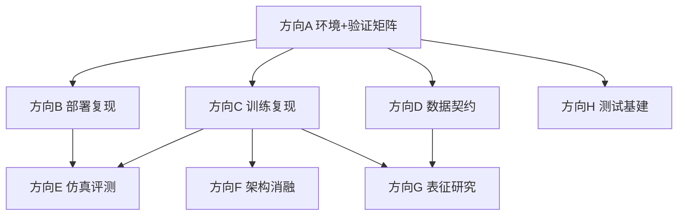

# OpenWAM 调研方向任务书（总索引）

> 版本：v1.0（2026-09-23）｜分析对象：`OpenWAM-Official/OpenWAM` @ `main` `90e94ae`
> 本文档是入口：先读 §1 了解仓库是什么，§2 选方向，再进入对应方向文档。
> 仓库根在本文档中记作 `$R`；文中所有路径均为 `$R` 下的相对路径，行号以 `90e94ae` 为准。

---

## 1. 仓库一分钟速览

**OpenWAM** 是一个 World–Action Model（WAM）系统预训练研究栈（论文 arXiv:2609.07398，Apache-2.0）：

- **OpenWAM-Infra**：模块化基础设施——模型（架构×骨干）、训练、推理部署、评测全部可组合替换；
- **OpenWAM-Study**：受控消融实验体系（官方发布 34 个 study checkpoint）；
- **OpenWAM-α**：518.5M 帧（约 6400 小时）egocentric human + robot 数据上预训练的开放基础模型（14 个 alpha checkpoint 发布在 HuggingFace）。

**端到端复现主干**：

```
环境(Docker/native) → 下载器(权重+数据) → train.sh(torchrun) → OpenWAMTrainer
  → checkpoint(自包含: config.yaml + safetensors + normalization_stats)
  → deploy.sh(WebSocket PolicyServer, ws://:8848) → benchmark 客户端(仿真器) → 成功率
```

**代码主结构**：

| 路径 | 内容 |
|---|---|
| `openwam/model/architectures/` | 6 个注册架构：single_system(vanilla/moe)、dual_system(joint_self_attn/joint_cross_attn/idm)、tri_system(joint_self_attn) |
| `openwam/model/video_backbone/` | 5 个视频骨干（Wan2.2-TI2V-5B / Wan2.1-VACE-1.3B / Wan2.1-I2V-14B / Cosmos-Predict2.5-2B / Cosmos3-Edge）+ encoder/（Wan VAE / DINOv3 / V-JEPA2.1 / FLUX.2 VAE） |
| `openwam/model/action_backbone/` | ActionDiT（dual/tri）与 SharedActionBackbone（single），flow-matching scheduler |
| `openwam/model/vlm_backbone/` | Qwen3-VL-2B-Instruct（tri_system 专用，冻结） |
| `openwam/train/` | OpenWAMTrainer：torchrun + Accelerate + DeepSpeed ZeRO-2 |
| `openwam/dataloader/` | 13 个注册数据集 reader，80-D unified action space |
| `openwam/deploy/` | WebSocket PolicyServer + sync/async 执行器 + 推理优化 |
| `benchmarks/` | 8 个 benchmark 客户端 + Labtasker 分布式评测 |
| `configs/` | Hydra 配置（model/dataloader/train/deploy 四层组合） |
| `scripts/` | 入口：train.sh / deploy.sh / download_assets/（5 个下载器）/ svae_train/ |
| `docker/` | CUDA 12.8.1 五阶段镜像 + 离线 bundle 交付 |
| `tests/` | ~146 个 pytest 模块：CPU 契约测试为主，GPU+权重可选 |

**资源底线**：训练 4×80GB 起步（推荐 8×80GB，2 卡 OOM 有官方记录）；部署单卡 ≥24GB；Docker 构建需 ≥60GB 磁盘；每 checkpoint ~25GB。

---

## 2. 方向总表（点进对应文档）

| 方向 | 文档 | 一句话 | 难度 | 前置 | 建议投入 |
|---|---|---|---|---|---|
| **A** | [方向A-环境搭建与验证矩阵.md](方向A-环境搭建与验证矩阵.md) | 搭好全组共享环境，产出"什么能跑"的验证矩阵 | 低-中 | 无 | 1 人，W1–W2（**全组阻塞依赖**） |
| **B** | [方向B-部署与推理复现.md](方向B-部署与推理复现.md) | checkpoint→服务→客户端跑通，量化推理性能 | 低-中 | A + 1 个 checkpoint | 1 人 |
| **C** | [方向C-训练管线复现.md](方向C-训练管线复现.md) | debug 冒烟→正式训练→α 微调全路径 | 中 | A + LIBERO + Wan2.2-5B | 1 人 |
| **D** | [方向D-数据管线与动作空间.md](方向D-数据管线与动作空间.md) | 数据契约权威文档 + 预训练混合复现边界 | 低-中（D5/D6 高） | A | 1 人 |
| **E** | [方向E-仿真评测复现.md](方向E-仿真评测复现.md) | 按难度梯队复现 8 个 benchmark 成功率 | 中-高 | A + B | 1–2 人 |
| **F** | [方向F-架构变体与注意力机制.md](方向F-架构变体与注意力机制.md) | 复现并扩展架构消融（mask/MoT/bridge/idm） | 中-高 | C 跑通后 | 1 人 |
| **G** | [方向G-视觉表征与骨干研究.md](方向G-视觉表征与骨干研究.md) | 外部 encoder/SVAE/VLM 的表征路线消融 | 高 | C 跑通后 + 额外权重 | 1 人 |
| **H** | [方向H-测试与质量基建.md](方向H-测试与质量基建.md) | 把复现过程沉淀为回归测试（贯穿轮值） | 低 | A | 0.5 人轮值 |

**依赖关系**：



**建议里程碑（估计）**：

| 阶段 | 周 | 并行内容 | 里程碑产出 |
|---|---|---|---|
| M1 | W1–W2 | A 主攻；全组并行读代码 + 本索引 | 环境 SOP + 验证矩阵 |
| M2 | W2–W4 | B、C（C1–C3）、D（D1–D4）、E1 环境准备 | 部署流水线 + 首个微调 checkpoint + 数据契约文档 |
| M3 | W4–W6 | E1 评测、C（C4–C6）、D5/D6 启动 | LIBERO 成功率对照 + 资源旋钮表 |
| M4 | W6–W10 | E2、F、G 全面启动 | 架构消融 + 表征复现 + RoboTwin 数字 |
| M5 | W10+ | 高阶项（F5、G5、E3、D5）+ 汇总 | 组内复现报告合订 |

人员配置建议（6–8 人）：A=1（M1 后转 E1）、B=1、C=1、D=1、E=1–2、F/G 各 1（M3 后从 B/C 转入）。

---

## 3. 全局风险登记册（各方向文档的 §6 有展开与代码锚点）

| # | 风险/缺口 | 影响 | 应对 |
|---|---|---|---|
| R1 | **预训练数据混合不完整**：egocentric human（EgoDex/Ego4D）reader 未发布（`openwam/dataloader/registry.py:91-106` 无注册，仅 docstring 残留）；`configs/dataloader/pretrain_data/` 全是 `/path/to` 占位 | OpenWAM-α 从头预训练**不可完整复现** | 以官方 checkpoint 微调为主路径；方向 D6 评估自实现 reader |
| R2 | LAPA/latent-action 工具链缺席（README 提及，代码零命中，已核验） | latent action 方向无仓库支撑 | 不预设该方向；需要时自行实现 |
| R3 | 算力门槛：训练最低 4×80GB | 资源不足时 F/G 受限 | 优先微调与小骨干（VACE-1.3B） |
| R4 | CI 无 GPU/模型覆盖（`.github/workflows/ci.yml` 仅 CPU torch） | "CI 绿" ≠ "复现可行" | 以方向 A 的验证矩阵为准 |
| R5 | 文档/代码不一致多处：`project.output_dir`（`configs/train.yaml:66` 定义但 trainer 用 `training.output_path`，`openwam/train/openwam_trainer.py:448`）；`--state-dim`（README 10 vs `assets/openwam_usage_docs/docker.md` 20）；`attention_mask_mode` 代码默认 `ACTION_SEES_VIDEO`（`openwam/model/architectures/single_system/vanilla.py:50`）vs yaml `mutual` | 按文档操作会踩坑 | 一律以代码与 checkpoint 内 `config.yaml` 为准 |
| R6 | EBench 的 Isaac Sim 4.1.0 不支持 Blackwell GPU | 硬件代际不合则 E3.2 不可行 | 启动前核对 GPU 代际 |
| R7 | RoboTwin prompt 模板双份维护（`benchmarks/robotwin/prompt_template.py` ↔ `openwam/dataloader/transforms/multiview.py`，靠测试钉住逐字节一致） | 单侧改动 → 静默分布偏移 | 改任一侧必须跑对应测试 |
| R8 | EGL×CUDA 驱动冲突（MuJoCo 系 benchmark，exit=-6） | 评测进程随机崩溃 | `--render-gpus` 物理隔离渲染与推理 GPU |
| R9 | Cosmos 路线需 submodule（当前为空）+ 编译 transformer-engine；DINOv3/FLUX.2 为 HF gated | G6/G2 启动阻塞 | 提前一周发起 submodule init 与 HF 授权 |
| R10 | `Wan21` 一个类注册两个名字，加载由 `model_path` 决定，name/path 失配仅 WARN | 静默加载错骨干 | 配置评审核对 name↔path 一致 |

---

## 4. 命令速查

```bash
# ---- 环境（Docker 路线）----
cp docker/.env.example .env          # 设 OPENWAM_UID/GID
make docker-build && make docker-check
make docker-integration-check PYTHON=python3
docker compose run --rm -T gpu-check  # 需 GPU

# ---- 环境（Native 路线）----
conda create -n openwam python=3.10 && conda activate openwam
pip install torch==2.7.1 torchvision==0.22.1 torchaudio==2.7.1 \
  --index-url https://download.pytorch.org/whl/cu128
pip install -e '.[dev]'               # deepspeed 现场编译需 gcc

# ---- 测试门禁 ----
make test                             # CPU 核心集（CI 等价）
OPENWAM_RUN_TRAIN_DEPLOY_GPU=1 python -m pytest -q tests/test_video_backbone_consistency.py  # GPU 层

# ---- 资产下载（均有 --name/--yes 非交互模式）----
python scripts/download_assets/download_video_backbone.py       # Wan2.2-TI2V-5B 等
python scripts/download_assets/download_benchmark_data.py       # LIBERO 等（自动建 stats+回写 yaml）
python scripts/download_assets/download_openwam_checkpoints.py  # alpha 14 + study 34
python scripts/download_assets/download_vlm_backbone.py         # tri_system 专用
python scripts/download_assets/download_visual_encoder.py       # DINOv3/V-JEPA/VAE

# ---- 训练 ----
bash scripts/train.sh dataloader=libero model=dual_system \
  model/video_backbone=wan22_ti2v_5b model.architecture.variant=joint_self_attn \
  model.architecture.attention_mask_mode=mutual training.debug=true   # 20 步冒烟
bash scripts/train.sh dataloader=libero \
  training.finetune_ckpt_path=<foundation_ckpt_dir>                   # α 微调

# ---- 部署与推理 ----
bash scripts/deploy.sh <ckpt_dir>     # ws://0.0.0.0:8848
python scripts/inference_test/inference_single_test.py --server ws://127.0.0.1:8848 --test --state-dim <N>
python scripts/inference_test/inference_continuous_test.py --server ws://127.0.0.1:8848 --test

# ---- Cosmos 可选依赖 ----
git submodule update --init third_party/cosmos-predict2.5
bash scripts/install_cosmos_predict25.sh   # 需 nvcc + cuDNN
```

**仓库内权威文档索引**：

- `assets/openwam_usage_docs/docker.md` — Docker/离线部署全流程
- `assets/openwam_usage_docs/train-and-deploy.md` — 训练与部署
- `assets/openwam_usage_docs/architecture-extension.md` — 架构/骨干扩展约定
- `assets/openwam_usage_docs/benchmark-integration.md` — benchmark 接入与线协议
- `assets/openwam_usage_docs/openwam-alpha-finetuning.md` — α 微调（80 维 action/state 契约）
- `benchmarks/README.md` — 客户端接入总指南
- `benchmarks/{robotwin,libero}/LABTASKER.md` — Labtasker 分布式评测

---

## 5. 附：调研方法说明

本任务书基于对仓库的 8 路并行只读调研（架构/骨干/训练/数据/部署/评测/基建/测试），关键结论经源码交叉核验（LAPA 缺席、EgoDex reader 缺席、mask 默认值不一致等均经 grep 复核）。完整版单文档见 `../OpenWAM调研方向分配与任务书.md`（含速查表全集）；本目录为按方向拆分的执行版。
