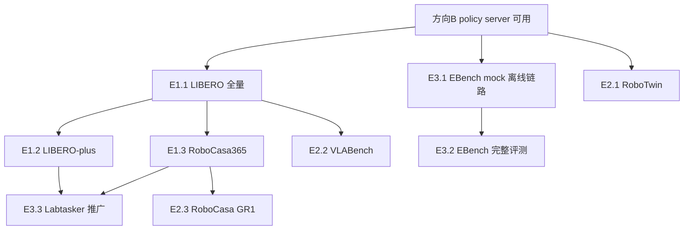

# 方向 E：仿真评测复现

> 一句话定位：把 OpenWAM 论文里的 8 个仿真 benchmark 成功率，用官方 checkpoint 按官方协议一条条复现出来，形成"我们的机器 ↔ 论文数字"的可比对照。读者：第一次接触该模块的同学。
> 前置：先读本目录 README.md 的总览，了解本方向在全局中的位置。

文中所有路径均为 OpenWAM 仓库相对路径（仓库根 = `OpenWAM/`）。行号以 `main @ 90e94ae` 为准；个别行号可能漂移，此时以符号名锚点为准。

**硬性前置**：本方向所有评测都依赖方向 B 已经搭好的 policy server（见 `方向B-部署与推理复现.md`）。先有可用的 server，再谈评测。

---

## 1. 这个方向做什么、为什么值得做

OpenWAM 论文的核心证据是成功率表格：OpenWAM-α 在 LIBERO / LIBERO-plus / RoboCasa365 / RoboCasa GR1 / VLABench / RoboTwin / EBench / RoboDojo 八个 benchmark 上对比 VLA 与其他 WAM。这些数字不是跑训练跑出来的，而是由一套**独立于训练栈的评测客户端**驱动仿真器、逐步调用 policy server 产生的。本方向就是把这套评测链路全部跑通并复现数字。

工程上最有意思的地方是评测层的拓扑：每个 benchmark 是一个**薄客户端**——一个独立 conda env 里只装仿真器和几百行适配代码，通过一条冻结的 WebSocket 线协议连到**厚服务端**（`openwam/deploy/server.py`，持模型、做预处理）。客户端永远不需要 import torch 或 openwam 包。你会学到：如何设计一条让"任何机器人/benchmark 都能接入"的最小协议、如何做跨本体动作空间转换、以及如何用 sealed manifest + RNG 隔离把"分布式评测"做成可复现的科学实验。

产出直接可用：每个 benchmark 的成功率复现报告（与论文逐格对比）、一套环境 SOP、以及把 Labtasker 分布式编排推广到更多 benchmark 的扩展工作。

## 2. 最小必要背景

**① 薄客户端 + 厚服务端拓扑。** 评测 = 两个进程、两个 conda env：`benchmarks/<bench>/` 下的客户端持有仿真器（MuJoCo/SAPIEN/Isaac Sim），server（`openwam/deploy/server.py`）持有模型；两边只经 WebSocket 通信，环境互不污染。锚点：`benchmarks/README.md:1-13`（"you don't need to know anything about the server"）、`benchmarks/robotwin/README.md:8`（"Two processes … so the two environments never interfere"）。客户端依赖极简：`numpy`、`Pillow`、`websockets`。

**② 线协议（冻结契约）。** 消息类型在两端硬编码且镜像一致：客户端侧 `benchmarks/utils/transport.py:20-31`（`OBS/RESET/PING` 上行，`ACTION/RESET_ACK/PONG/ERROR` 下行），服务端真源 `openwam/deploy/server.py:56-67`（注释明言 "a frozen wire contract and must never change"）。每步控制 = 一次 `obs`（base64 PNG 相机帧 `head_camera` 必填 + `prompt` 逐字转发 + 可选 `state`）→ 一次 `action`（物理单位动作 + `step` + `latency_ms`）。episode 边界必须 `reset()`，否则 server 端 action chunk buffer 会跨 episode 泄漏（`benchmarks/README.md:73-87`）。传输类是 `WSPolicyClient`（`transport.py:43`）：obs/reset 丢线自动重连一次，ping 快速失败。

**③ repr_contract 握手校验。** server 加载 checkpoint 时从**训练配置**提取表示契约：`openwam/deploy/model_loader.py:237-255` `repr_contract_from_cfg`（核心字段 `representation` = 训练时 `dataloader.action_mode`，可选 `binary_action_dims` / `gripper_convention`）。`ping` 的 PONG 会带上这份契约与 `readiness_token`（`server.py:181-187` `_pong_payload`）。客户端启动时硬校验：LIBERO 侧 `benchmarks/libero/openwam2libero_interface.py:129-133`（representation 不匹配直接 `RuntimeError`），RoboCasa365 侧 `benchmarks/robocasa365/openwam2robocasa365_interface.py:279-282`。作用：拿 RoboTwin checkpoint 去评 LIBERO 会在第一步就被拒绝，而不是静默产出垃圾成功率。

**④ 动作空间转换中心。** 每个机器人本体的动作/状态维度不同，统一换算集中在 `benchmarks/utils/action_conversion.py`（762 行，纯 numpy，客户端可独立使用）。关键符号：`eef20d_to_ee16d`（:103）、`eef10_to_robocasa12d`（:153）/`eef20d_to_robocasa12d`（:244）、`robotwin_endpose_to_eef20d`（:271）、`raw23_to_ebench_action`（:615，EBench RAW-23）、`eef10_to_vlabench_ee`（:728）。注意例外：LIBERO 的 EEF10→LIBERO-7D OSC 转换在接口文件里（`benchmarks/libero/openwam2libero_interface.py:37` `native_eef10_to_libero7d`），不在 action_conversion.py。server 返回的动作已是**反归一化后的物理单位**（eef 用米、joint 用弧度），客户端不要再乘 mean/std（`benchmarks/README.md:62`）。

**⑤ Labtasker 三件套（可复现分布式评测）。** 目前只有 RoboTwin 和 LIBERO 有原生 Labtasker 工作流（`benchmarks/{robotwin,libero}/LABTASKER.md`），靠三个公共件支撑：
- `benchmarks/utils/eval_manifest.py`：sealed manifest——`seal_manifest`（:56，canonical JSON + sha256）、`publish_manifest`（:178，内容寻址、只替换索引指针不改旧文件）、`load_cached_manifest`（:161）。评测的 episode 列表/种子一旦 seal 就不可变，换 checkpoint 重评也复用同一份 manifest。
- `benchmarks/utils/task_policy.py`：`resolve_policy_model_spec`（:22，解析部署参数快照）、`WorkerPolicyServer`（:71，每个 Worker 独占一个 server，靠 `readiness_token` 防串台）。
- `benchmarks/utils/rng_domain.py`：`GlobalRngDomain`（:115，把 Python/NumPy/Torch 全局 RNG 状态做成可移动游标，只在 owner 调用窗口内激活），保证并发 Worker 之间随机性隔离。
配套：`labtasker_utils.py` 的 `submit_tasks`（:101，幂等提交）与 `validate_submission_coverage`（:161，提交前覆盖性检查）。

## 3. 代码地图

```
benchmarks/
├── README.md                     # 客户端接入总指南 + 线协议全文（入口文档）
├── utils/                        # 跨 benchmark 公共库（客户端可独立 import）
│   ├── transport.py              # WSPolicyClient + 协议常量（客户端镜像）
│   ├── client.py                 # build_payload/encode_numpy_b64/resize_for_lshape_slot/ServerError
│   ├── action_conversion.py      # 动作空间转换中心（762 行）
│   ├── eval_manifest.py          # sealed manifest（seal/verify/publish/load_cached）
│   ├── labtasker_utils.py        # submit_tasks / validate_submission_coverage
│   ├── task_policy.py            # WorkerPolicyServer / resolve_policy_model_spec
│   ├── rng_domain.py             # GlobalRngDomain
│   └── task_progress.py / eval_sharding.py / owned_processes.py
├── libero/                       # E1.1 —— 入口接口 openwam2libero_interface.py:OpenWAMLiberoPolicy；配置 policy_config.yml
│   ├── setup_env.sh              # 一键环境（钉 LIBERO commit 8f1084e，脚本第 12 行）
│   ├── run_eval.sh / scheduler.py / run_all_suites.py   # 托管式全量评测（自起 server、多 GPU 调度）
│   ├── single_eval.sh / single_eval.py                  # 单 suite 单任务
│   ├── run_smoke.sh / smoke_libero.py                   # env/import/task 三级自检
│   └── LABTASKER.md + labtasker_{submit,worker,summarize,runtime}.py
├── libero-plus/                  # E1.2 —— 入口接口 openwam2libero_interface.py；配置 policy_config.yml（num_trials:1, seed:10000）
│   └── setup_env.sh              # 钉 commit 4976dc3（脚本第 11 行）+ assets.zip SHA-256 校验
├── robocasa365/                  # E1.3 —— 入口接口 openwam2robocasa365_interface.py（state19/action15→action12）；配置 policy_config.yml
│   ├── setup_env.sh              # 一键环境（钉 robocasa a07e365 / robosuite 5ce6643）
│   ├── target_tasks.txt          # 官方 50 target tasks（18 atomic + 32 composite）
│   └── run_eval.sh / multi_eval.sh / run_smoke.sh
├── robocasa_gr1/                 # E2.3 —— 入口接口 openwam2robocasa_gr1_interface.py（GR1Kinematics EEF33 FK/IK）；配置 policy_config.yml（无 setup_env.sh！）
├── vlabench/                     # E2.2 —— 入口接口 openwam2vlabench_interface.py:OpenWAMVLABenchPolicy；配置 policy_config.yml（eval_track/head_camera_index:2）
├── robotwin/                     # E2.1 —— 入口接口 openwam2robotwin_interface.py:ModelClient；配置 policy_config.yml（action_type/state_dim:20）
│   ├── eval_policy_wrapper.py    # 按路径加载并 monkeypatch 上游 script/eval_policy.py
│   ├── prompt_template.py        # RoboTwin prompt 包装（与训练侧逐字节一致）
│   ├── step_limits.yml           # 每任务步数上限（默认全注释）
│   └── LABTASKER.md + labtasker_{worker,summarize}.py
├── ebench/                       # E3.1/E3.2 —— 入口接口 openwam2ebench_interface.py:EBenchOpenWAMDriver；配置 policy_config.yml
│   └── mock_genmanip_server.py   # 无 Isaac Sim 时的离线契约验证服务器
└── robodojo/                     # 仅 README.md：评测完全走外部 XPolicyLab，本方向不覆盖
```

服务侧（方向 B 的地盘，本方向只需会用）：`openwam/deploy/server.py`、`openwam/deploy/model_loader.py`、`scripts/deploy.sh`。

## 4. 任务书

### 任务 E1.1：LIBERO 环境 + 全 4 suite 评测（40 任务 × 50 trials）

- **目标**：一键环境 + 官方 LIBERO checkpoint 全量评测，产出 `summary.csv` 并与论文数字逐格对比（论文 Avg 99.3，见 `benchmarks/libero/README.md:113`）。
- **前置**：方向 B 的部署流程可用；联网；≥2 张 GPU 最舒服（渲染与推理隔离用）。
- **步骤**：
  1. 搭客户端环境（钉 commit `8f1084e3132a39270c3a13ebe37270a43ece2a01`，Python 3.10 + mujoco 3.3.2 + robosuite 1.4.0，脚本自动校验全部版本）：
     ```bash
     CONDA_BIN=/path/to/miniconda3/bin/conda \
     LIBERO_ENV_PREFIX=/path/to/miniconda3/envs/libero \
     LIBERO_PATH=/path/to/LIBERO \
     bash benchmarks/libero/setup_env.sh
     ```
  2. 冒烟（无需模型）：`LIBERO_PATH=/path/to/LIBERO LIBERO_PYTHON=/path/to/miniconda3/envs/libero/bin/python bash benchmarks/libero/run_smoke.sh env`
  3. 下载 checkpoint：`python scripts/download_assets/download_openwam_checkpoints.py`（菜单选 `OpenWAM_Alpha → OpenWAM-Alpha-Sim-LIBERO`），落到 `assets/openwam_ckpt/openwam_alpha/OpenWAM-Alpha-Sim-LIBERO`。
  4. 全量评测（托管 launcher 自起 server，跑完自动回收；注意启动顺序逻辑是**先 server 后 client**，scheduler 会等 server 就绪）：
     ```bash
     SERVER_PYTHON=/path/to/miniconda3/envs/openwam/bin/python \
     LIBERO_PYTHON=/path/to/miniconda3/envs/libero/bin/python \
     LIBERO_PATH=/path/to/LIBERO \
     GPUS=0,1 REPLICAS_PER_GPU=1 \
     bash benchmarks/libero/run_eval.sh \
       assets/openwam_ckpt/openwam_alpha/OpenWAM-Alpha-Sim-LIBERO checkpoint_step_10690.safetensors \
       --compile-enabled false --render-gpus 2,3
     ```
     先加 `--smoke` 做一次单任务端到端验证再跑全量。`--render-gpus 2,3` 把 EGL 渲染放到物理 GPU 2/3，与推理 GPU 0/1 隔离（见 §6 风险 R-E1）。
  5. 结果在 `--output-dir`（默认 `outputs/libero/...`）：`summary.csv`、`summary.json`、`manifest.json`、per-task `results.json`。
- **验收标准**：4 suite（libero_spatial/object/goal/libero_10）×10 任务×50 trials 全部完成；`summary.csv` 生成；与论文表格逐格对比并写偏差分析（协议由代码钉死：50 trials/task、seed 42、`max_steps` 600/`libero_10` 700，见 `benchmarks/libero/README.md:81` 与 `benchmarks/libero/policy_config.yml:9-16`）。
- **产出**：LIBERO 成功率对照表 + 偏差分析 + 环境记录（driver 版本、是否用了 `--render-gpus`/`--compile-enabled false`）。
- **难度（估计）**：中。**工作量（估计）**：环境 0.5 天 + 全量评测 1–2 天（取决于 GPU 数）。
- **代码锚点**：`benchmarks/libero/openwam2libero_interface.py:37 native_eef10_to_libero7d`、`:129-133` repr 握手、`benchmarks/libero/scheduler.py:1096 --render-gpus` 参数。

### 任务 E1.2：LIBERO-plus 扰动套件复现（7 类扰动矩阵）

- **目标**：复现 LIBERO-plus 的扰动鲁棒性评测，产出 7 类扰动（Camera/Robot/Language/Light/Background/Noise/Layout）× 成功率矩阵（论文 OpenWAM-α Avg 69.2，见 `benchmarks/libero-plus/README.md:103`）。
- **前置**：E1.1 完成（用的是**同一个 LIBERO checkpoint**，没有 plus 专用 checkpoint，`benchmarks/libero-plus/README.md:43`）。
- **步骤**：
  1. 环境（钉 commit `4976dc30028e805ff8094b55501d532c48fec182`，见 `benchmarks/libero-plus/setup_env.sh:11`；额外从 HF `Sylvest/LIBERO-plus` 下载数 GB assets.zip 并 SHA-256 校验，SHA 钉在 `setup_env.sh:13`）：
     ```bash
     CONDA_BIN=/path/to/miniconda3/bin/conda \
     LIBERO_PLUS_ENV_PREFIX=/path/to/miniconda3/envs/libero-plus \
     LIBERO_PLUS_PATH=/path/to/LIBERO-plus \
     bash benchmarks/libero-plus/setup_env.sh
     ```
  2. 冒烟：`... bash benchmarks/libero-plus/run_smoke.sh env`。
  3. 全量（协议与 E1.1 不同：**1 trial/task、seed 10000、`rng_mode: official_global`**，启动时强制校验，`benchmarks/libero-plus/README.md:76`、`benchmarks/libero-plus/policy_config.yml`）：
     ```bash
     SERVER_PYTHON=/path/to/miniconda3/envs/openwam/bin/python \
     LIBERO_PLUS_PYTHON=/path/to/miniconda3/envs/libero-plus/bin/python \
     LIBERO_PLUS_PATH=/path/to/LIBERO-plus \
     GPUS=0,1 REPLICAS_PER_GPU=1 \
     bash benchmarks/libero-plus/run_eval.sh \
       assets/openwam_ckpt/openwam_alpha/OpenWAM-Alpha-Sim-LIBERO checkpoint_step_10690.safetensors \
       --compile-enabled false --render-gpus 2,3
     ```
  4. `summary.csv`/`summary.json` 自带 per-perturbation-category 分解（源自上游 `task_classification.json`）。
- **验收标准**：7 类扰动成功率矩阵完整；与论文逐格对比；Camera/Robot/Noise 三类（论文中 OpenWAM-α 明显弱项）偏差单独讨论。
- **产出**：扰动-成功率矩阵 + 偏差分析。
- **难度（估计）**：中。**工作量（估计）**：环境 0.5 天 + 评测 1 天。
- **代码锚点**：`benchmarks/libero-plus/setup_env.sh:11-13`、`benchmarks/libero-plus/policy_config.yml`（`num_trials: 1`、`seed: 10000`、`rng_mode: official_global`）。

### 任务 E1.3：RoboCasa365 评测（50 target tasks）

- **目标**：复现 RoboCasa365 leaderboard 协议（`pretrain` split，50 target tasks = 18 atomic + 32 composite），对照论文 Avg 38.2（`benchmarks/robocasa365/README.md:114`）。
- **前置**：方向 B；~10GB 仿真资产 + 磁盘空间。
- **步骤**：
  1. 一键环境（钉 robocasa `a07e365c958c4216cd6bbd5f30b47f09a65c6f00`（v1.0.1，含官方 1.5× horizon 更新）+ robosuite `5ce6643f3092639d08f7b0f90ed1c6a84f50552c`，Python 3.11 + mujoco 3.3.1，`benchmarks/robocasa365/README.md:29-30`）：
     ```bash
     CONDA_BIN=/path/to/miniconda3/bin/conda \
     ROBOCASA365_ENV_PREFIX=/path/to/miniconda3/envs/robocasa365 \
     ROBOCASA365_PATH=/path/to/robocasa ROBOSUITE_PATH=/path/to/robosuite \
     bash benchmarks/robocasa365/setup_env.sh
     ```
  2. 冒烟：`ROBOCASA365_PYTHON=... bash benchmarks/robocasa365/run_smoke.sh env OpenDrawer`。
  3. 下载 `OpenWAM-Alpha-Sim-RoboCasa365` checkpoint 并起 server（`bash scripts/deploy.sh assets/openwam_ckpt/openwam_alpha/OpenWAM-Alpha-Sim-RoboCasa365`）。
  4. **改 trials**：默认 `policy_config.yml` 是 smoke 规模（`num_trials: 5`）；正式评测复制一份改 `num_trials: 50`，用 `ROBOCASA365_POLICY_CONFIG=/path/to/custom.yml` 指过去。`max_steps_override` 保持 `null`（horizon 由 robocasa 官方注册表运行时读取）。
  5. 全量 50 任务：
     ```bash
     ROBOCASA365_PYTHON=/path/to/miniconda3/envs/robocasa365/bin/python \
     ROBOCASA365_POLICY_CONFIG=/path/to/custom.yml \
     bash benchmarks/robocasa365/multi_eval.sh --out ./results_robocasa365 target
     ```
     （`target` 在此是任务列表 token，展开 `target_tasks.txt`；或用托管式 `run_eval.sh`。）
- **验收标准**：50 任务成功率记录 + `summary_pretrain.csv`；与论文 Atomic/Comp.-Seen/Comp.-Unseen 三列对照。
- **产出**：成功率记录 + 与论文对比表。
- **难度（估计）**：中。**工作量（估计）**：环境 0.5 天 + 评测 1–2 天。
- **代码锚点**：`benchmarks/robocasa365/openwam2robocasa365_interface.py:279-282`（representation 必须为 `robocasa365`）、`benchmarks/utils/action_conversion.py:153 eef10_to_robocasa12d`、`benchmarks/robocasa365/target_tasks.txt`。

### 任务 E2.1：RoboTwin 端到端（钉 commit 环境 → smoke → 单任务 100ep → 全 50 任务）

- **目标**：复现论文 RoboTwin2.0-Full 数字（OpenWAM-α Clean 93.74 / Randomized 93.46，`benchmarks/robotwin/README.md:132`）与 Clean2Random OOD 数字，全程留 provenance。
- **前置**：方向 B；**415GB** RoboTwin2.0 数据（见 §6 R-E4）；驱动/CUDA 组合能跑 SAPIEN 3.0.0b1 + cuRobo。
- **步骤**：
  1. 按 `benchmarks/robotwin/README.md:26-36` 的版本表搭独立环境：RoboTwin 钉 commit `0aeea2d669c0f8516f4d5785f0aa33ba812c14b4`（2026-04-19）、Python 3.10、SAPIEN 3.0.0b1、cuRobo v0.7.8、warp-lang 1.13.0、mplib 0.2.1、torch 2.4.1；再 `pip install websockets pyyaml`。**不要**把这套装进 OpenWAM env。
  2. 下载 `OpenWAM-Alpha-Sim-RoboTwin-Full` checkpoint，`bash scripts/deploy.sh <ckpt_dir>` 起 server（先 server 后 client；客户端健康检查最多等 300s）。
  3. 对齐 `benchmarks/robotwin/policy_config.yml` 与 checkpoint：`action_type: ee` + `state_dim: 20`（ee checkpoint）或 `qpos` + `14`。
  4. Smoke：`ROBOTWIN_TEST_NUM=5 ROBOTWIN_PATH=/path/to/RoboTwin ROBOTWIN_PYTHON=... bash benchmarks/robotwin/single_eval.sh adjust_bottle demo_clean openwam 0`。确认 wrapper 打印 `prewarmed CUDA/Curobo before SAPIEN import`、`patched warp.torch compatibility namespace`、`RoboTwin commit=… eval_policy.py sha256=…`（都是预期输出，见 §6 R-E2）。
  5. 单任务 100 ep：去掉 `ROBOTWIN_TEST_NUM` 重跑同一任务，对照论文单任务量级。
  6. 全 50 任务（每模式多 GPU-小时）：`bash benchmarks/robotwin/multi_eval.sh -m demo_clean -n run1 -d <ckpt_dir> all`，再 `-m demo_randomized`。
  7. 结果在 RoboTwin checkout 的 `eval_result/`；`multi_eval.sh` 另外在 `<ckpt_dir>/robotwin_eval_logs/` 落 per-task 日志与 `run.env` provenance。
- **验收标准**：成功率日志 + provenance 记录（commit/sha256/版本表/`run.env`）；Clean 与 Randomized 两模式全 50 任务 × 100 ep。
- **产出**：RoboTwin 复现报告（对照论文两张表）+ 环境 SOP。
- **难度（估计）**：高。**工作量（估计）**：环境 1–2 天（版本耦合）+ 评测 2–4 天。
- **代码锚点**：`benchmarks/robotwin/eval_policy_wrapper.py:150 _prewarm_cuda_for_curobo`、`:176 _patch_warp_torch_namespace`、`:452 _install_manifest`、`:532 _install_eval`；`benchmarks/robotwin/step_limits.yml`。

### 任务 E2.2：VLABench 6 track 评测（注明 track_5 无 episode config）

- **目标**：分 track 复现成功率（SR）/progress score/intention score 三项指标，对照论文 Avg SR 71.6（`benchmarks/vlabench/README.md:194`）。
- **前置**：方向 B；~17GB 资产 + 13.2GB 数据；**钉 VLABench commit**（上游 main 上若干任务无法实例化，且 track_5 只按 commit 可复现，`benchmarks/vlabench/README.md:66-70`）。
- **步骤**：
  1. 手搭环境（无 setup 脚本；钉 `numpy==1.25.0`/`mujoco==3.2.2`/`dm_control==1.0.22`，评测精简安装命令见 `benchmarks/vlabench/README.md:18-26`；headless 机器再装 conda-forge 的 `libegl mesalib libglvnd` + CPU torch）。
  2. 冒烟：`VLABENCH_PATH=/path/to/VLABench VLABENCH_PYTHON=... bash benchmarks/vlabench/run_smoke.sh env select_fruit`；`run_smoke.sh loop select_fruit` 可走进程内 mock 全闭环。
  3. 下载 `OpenWAM-Alpha-Sim-VLABench`，起 server。
  4. 逐 track 评测：`bash benchmarks/vlabench/single_eval.sh all track_1_in_distribution 50 8848`，track 列表 `track_1_in_distribution … track_6_unseen_texture`（每任务预算 30–60 min）。
  5. **track_5 特殊处理**：`track_5_cross_task` 上游不发布 episode config（`benchmarks/vlabench/README.md:160`、`benchmarks/vlabench/multi_eval.sh:50-53`），只能给 `single_eval.sh` 显式任务名，或用 `multi_eval.sh` 的 `VLABENCH_TRACK5_TASKS` / 内置 8 个 held-out 任务默认值（seeded episodes，seed=42+i）。报告中必须注明这一协议差异。
  6. 多 GPU sweep：每端口一个 server（`for i in 0 1 2 3; do CUDA_VISIBLE_DEVICES=$i nohup bash scripts/deploy.sh <ckpt> --device cuda:0 --port $((8880+i)) & done`），再 `bash benchmarks/vlabench/multi_eval.sh all all 50 8880,8881,8882,8883`。
  7. 结果：`benchmarks/vlabench/_eval_out/` 下 `combined_results.json` + per-task `detail_info.json`；注意请求 episode 数 ≠ 有效记录数，引用分数前先查日志。
- **验收标准**：分 track SR/PS/IS 表；track_5 的协议说明；与论文逐格对比。
- **产出**：分 track 成功率表 + track_5 现状说明。
- **难度（估计）**：中-高。**工作量（估计）**：环境 1 天 + 评测 2–3 天。
- **代码锚点**：`benchmarks/vlabench/openwam2vlabench_interface.py:OpenWAMVLABenchPolicy`、`benchmarks/vlabench/single_eval.py:37 OPEN_TRACK`、`benchmarks/vlabench/policy_config.yml`（`eval_track`/`head_camera_index: 2`）。

### 任务 E2.3：RoboCasa GR1（无 setup 脚本需手搭）

- **目标**：评测 24 个 `gr1_unified/*` env，对照论文 SR 60.5（`benchmarks/robocasa_gr1/README.md:102`）。
- **前置**：方向 B；43.9GB 数据（训练用，评测只需 tabletop assets）；EGL 可用。
- **步骤**：
  1. 手搭环境（`benchmarks/robocasa_gr1/README.md:9-21`；关键是 `pip install -e .` 后**先 uninstall 再钉版本**：`pip uninstall -y robosuite mujoco && pip install robosuite==1.5.1 mujoco==3.2.6`，官方仓库 import 时断言这两个版本）：
     ```bash
     conda create -c conda-forge -n robocasa-gr1 python=3.10 -y && conda activate robocasa-gr1
     git clone https://github.com/robocasa/robocasa-gr1-tabletop-tasks /path/to/robocasa-gr1-tabletop-tasks
     cd /path/to/robocasa-gr1-tabletop-tasks && pip install -e .
     pip uninstall -y robosuite mujoco && pip install robosuite==1.5.1 mujoco==3.2.6
     pip install pyyaml numpy Pillow websockets
     python robocasa/scripts/download_tabletop_assets.py -y
     ```
  2. 冒烟：`ROBOCASA_GR1_PATH=... ROBOCASA_GR1_PYTHON=... ROBOCASA_GR1_ENABLE_RENDER=1 bash benchmarks/robocasa_gr1/run_smoke.sh env`（成功打印 `env_smoke=ok`；EGL 故障签名是 `AttributeError: 'NoneType' object has no attribute 'eglQueryString'`）。
  3. 下载 `OpenWAM-Alpha-Sim-RoboCasa-GR1`，起 server。
  4. 逐 env 评测（一个 server 串行处理 24 个 env）：
     ```bash
     ROBOCASA_GR1_PATH=... ROBOCASA_GR1_PYTHON=... ROBOCASA_GR1_GPU=0 \
     bash benchmarks/robocasa_gr1/single_eval.sh gr1_unified/PnPCupToDrawerClose_GR1ArmsAndWaistFourierHands_Env 8848 127.0.0.1
     ```
     正式跑时复制 `policy_config.yml` 调 `num_episodes`；`max_steps` 720。
- **验收标准**：24 env 评测记录（per-episode `[RESULT]` 行 + `Success rate: n/N`），与论文 SR 对比。
- **产出**：GR1 评测记录 + 手搭环境 SOP。
- **难度（估计）**：中-高。**工作量（估计）**：环境 1 天（无脚本）+ 评测 1–2 天。
- **代码锚点**：`benchmarks/robocasa_gr1/openwam2robocasa_gr1_interface.py`（EEF33：发 33 维 state、要求 33 维 action，否则抛错）、`benchmarks/robocasa_gr1/policy_config.yml`。

### 任务 E3.1：EBench mock 离线链路（mock_genmanip_server.py 验证动作契约）

- **目标**：不装 Isaac Sim，用 mock 服务器重放一个 EBench-Dataset bucket，验证 EBench bridge 的动作契约（形状/范围），产出校验通过的 `ebench_mock_actions.jsonl`。
- **前置**：方向 B 的 server；一个 EBench-Dataset bucket；训练 env（需要 `pandas`、`pyarrow`、`av`）。
- **步骤**：
  1. 下载单 bucket：`huggingface-cli download InternRobotics/EBench-Dataset --repo-type dataset --local-dir assets/benchmark_data/ebench --include 'simple_pnp/task1/*'`。
  2. 起 mock（训练 env 中）：
     ```bash
     python benchmarks/ebench/mock_genmanip_server.py \
       --dataset-dir assets/benchmark_data/ebench --bucket simple_pnp/task1 \
       --episodes 2 --steps-per-episode 8 --port 8087
     ```
  3. 另一 shell 起 policy server（`bash scripts/deploy.sh assets/openwam_ckpt/openwam_alpha/OpenWAM-Alpha-Sim-EBench`），然后跑单 worker：`EBENCH_PYTHON=... bash benchmarks/ebench/single_eval.sh --url http://127.0.0.1:8087 --ckpt-config assets/openwam_ckpt/openwam_alpha/OpenWAM-Alpha-Sim-EBench/config.yaml`（mock 模式省略 `--run-id`）。
- **验收标准**：mock 日志出现 `run complete: 2 episodes, 16 steps bridged` 与 `16 actions, 0 violations`；`./ebench_mock_actions.jsonl` 生成（契约违例会返回 HTTP 500 且 bridge 非零退出）。
- **产出**：`ebench_mock_actions.jsonl` + 契约校验记录。
- **难度（估计）**：低-中。**工作量（估计）**：0.5–1 天。
- **代码锚点**：`benchmarks/ebench/mock_genmanip_server.py:1-5`（职责说明）、`:27-31`（GenManip 动作限幅常量）、`benchmarks/ebench/openwam2ebench_interface.py:323 verify_ckpt_config`。

### 任务 E3.2：EBench 完整评测（Isaac Sim 4.1.0；不支持 Blackwell，启动前先核对 GPU 代际）

- **目标**：复现 EBench generalist `test_mini` 的 510 episode 评测（26 tasks × 20 ep，其中 `make_sandwich`/`microwave` 各 15 ep），对照论文 Overall SR 49.4 / Score 64.7（`benchmarks/ebench/README.md:120`）。
- **前置**：E3.1 通过；方向 B；**先核对 GPU 代际——Isaac Sim 4.1.0（CUDA 12.1）不支持 Blackwell 架构 GPU**（`benchmarks/ebench/README.md:9`），Blackwell 机器上此任务不可行，直接在报告里记录硬件结论即可；305GB 数据 + ~34GB EBench-Assets。
- **步骤**：
  1. 核对 GPU：`nvidia-smi --query-gpu=name --format=csv`；Blackwell（B100/B200/GB200 等）→ 停止并记录。
  2. sim 机：按 EBench 官方环境指南装 Isaac Sim 4.1.0 + cuRobo + EBench-Assets（~34GB）。
  3. bridge env（无 torch）：`git clone --recursive https://github.com/InternRobotics/EBench && cd EBench && pip install -e third_party/genmanip-client && pip install numpy Pillow "websockets>=15" PyYAML opencv-python-headless "PyTurboJPEG<2" filelock`。
  4. sim 机起服务：`python ray_eval_server.py --host 0.0.0.0 --port 8087 --no_save_process`，提交 `gmp submit ebench/generalist/test_mini --run_id <run_id>`。
  5. 按论文协议起 server：`NUM_GPUS=4 bash scripts/deploy.sh assets/openwam_ckpt/openwam_alpha/OpenWAM-Alpha-Sim-EBench --compile-enabled false optimization.dit_cache.enabled=false`（**dit_cache 必须关**，否则数字不可比，`benchmarks/ebench/README.md:104`）。
  6. 并行 worker：`NUM_WORKERS=4 EBENCH_PYTHON=... bash benchmarks/ebench/multi_eval.sh --url http://<sim-host>:8087 --run-id <run_id> --ckpt-config <ckpt>/config.yaml`。
  7. 结果：GenManip 写 `saved/eval_results/<task>/<run_id>/`；bridge 镜像 `episode_result.json` 到 `client_results/`。
- **验收标准**：test_mini 510 ep 结果；分 Family（TableTop/PnP/LongHorizon）SR/Score 与论文对照。
- **产出**：EBench 复现报告 + 硬件代际结论。
- **难度（估计）**：高。**工作量（估计）**：环境 1–2 天 + 评测 2–3 天（步预算 600–5000/任务）。
- **代码锚点**：`benchmarks/ebench/openwam2ebench_interface.py:323-343 verify_ckpt_config`（硬校验 `dataloader.type=ebench`/`action_mode=eef`/`unify_action=true`，缺失 `--ckpt-config` 仅告警）、`benchmarks/utils/action_conversion.py:615 raw23_to_ebench_action`。

### 任务 E3.3：Labtasker 工作流横向推广（为 robocasa365/libero-plus 补 Labtasker 编排）

- **目标**：目前只有 RoboTwin/LIBERO 有原生 Labtasker 编排（sealed manifest + RNG 隔离 + Worker 独占 server）。为 robocasa365 与 libero-plus 各补一套：`LABTASKER.md` + `labtasker_submit.py` / `labtasker_worker.py` / `labtasker_summarize.py`。
- **前置**：E1.1/E1.2/E1.3 的传统 launcher 已跑通（知道协议参数）；通读 `benchmarks/libero/LABTASKER.md` 与 `benchmarks/robotwin/LABTASKER.md`。
- **步骤**：
  1. 读三件套源码：`benchmarks/utils/eval_manifest.py`（`seal_manifest:56`/`publish_manifest:178`）、`benchmarks/utils/task_policy.py`（`WorkerPolicyServer:71`/`resolve_policy_model_spec:22`）、`benchmarks/utils/rng_domain.py`（`GlobalRngDomain:115`），以及 `benchmarks/utils/labtasker_utils.py`（`submit_tasks:101`/`validate_submission_coverage:161`）。
  2. 以 `benchmarks/libero/labtasker_{submit,worker,summarize,runtime}.py` 为模板，抽象出 benchmark 可变部分（任务枚举、env 构造、每任务 trials、manifest cache_key），为 robocasa365 实现 submit/worker/summarize；libero-plus 注意协议差异（1 trial、seed 10000、`rng_mode: official_global`——RNG 域语义与 LIBERO 不同，照搬前要确认 `GlobalRngDomain` 与 official_global 不冲突）。
  3. 写 `benchmarks/robocasa365/LABTASKER.md`、`benchmarks/libero-plus/LABTASKER.md`（结构照抄现有两篇：setup → first run 建 manifest cache → run evaluation → summarize）。
  4. 对照实验：同一 checkpoint 分别用传统 launcher 与 Labtasker 工作流跑同一任务集，核对成功率一致。
- **验收标准**：两篇新 `LABTASKER.md` + 可运行的 submit/worker 链路；与传统 launcher 的一致性对照记录。
- **产出**：Labtasker 扩展代码与文档（建议提交到组内 fork，勿改动 `OpenWAM/` 调研仓库）。
- **难度（估计）**：中。**工作量（估计）**：2–3 天/benchmark。
- **代码锚点**：`benchmarks/utils/labtasker_utils.py:101`、`benchmarks/utils/task_policy.py:71`、`benchmarks/utils/rng_domain.py:115`、`benchmarks/libero/labtasker_worker.py`。

## 5. 建议推进顺序与里程碑



| 里程碑 | 内容 | 达成判据 |
|---|---|---|
| ME1（第 1 周） | E1.1 + E3.1 | LIBERO summary.csv 对照论文；mock `0 violations` |
| ME2（第 2–3 周） | E1.2 + E1.3 | 扰动矩阵 + RoboCasa365 50 任务对照 |
| ME3（第 3–5 周） | E2.1/E2.2/E2.3 并行 | RoboTwin 两模式数字、VLABench 分 track 表、GR1 24 env |
| ME4（第 5 周+，选做） | E3.2 + E3.3 | EBench 510 ep（硬件允许时）；Labtasker 扩展 |

排期理由：E1.1 是协议握手、`--render-gpus`、托管 launcher 的最小练兵场，先打穿它后面全是同构问题；E3.1 无仿真依赖、可与 E1.1 并行，提前暴露 EBench 动作契约问题；E2.1 数据体量最大（415GB），下载要与环境搭建并行启动。

## 6. 风险与坑

- **R-E1 EGL × CUDA 驱动冲突（exit=-6）**：MuJoCo 系 benchmark（LIBERO/LIBERO-plus/RoboCasa365/RoboCasa GR1/VLABench）的 EGL 离屏渲染与 CUDA 推理共享物理 GPU 时，客户端会在 `mjr_readPixels` 内 abort，日志停在 `[OpenWAMLiberoPolicy]` 行后，退出码 `exit=-6`。官方在 driver 570.124.06 上用无关进程的 `torch.matmul` 循环复现过——是驱动级冲突，不是你的 bug。规避：渲染与推理物理隔离，`GPUS=0,1 ... --render-gpus 2,3`（`--render-gpus` 定义见 `benchmarks/libero/scheduler.py:1096`，按 policy-GPU slot 映射渲染设备并设置 `CUDA_VISIBLE_DEVICES`+`MUJOCO_EGL_DEVICE_ID`，`scheduler.py:299-300`；现象与解法原文见 `benchmarks/libero/README.md:82`、`benchmarks/libero-plus/README.md:78`）。单机单卡时可设 `MUJOCO_GL=osmesa` 走 CPU 渲染兜底（慢）。另有 server 端坑：`torch._inductor` 触发 `none_dealloc` 崩溃 → 一律加 `--compile-enabled false`（`benchmarks/libero/README.md:83`）。
- **R-E2 RoboTwin 版本强耦合 + monkeypatch 上游**：`benchmarks/robotwin/eval_policy_wrapper.py` 按路径加载并 patch 上游 `script/eval_policy.py`，因此与上游布局硬绑定：RoboTwin 必须钉 commit `0aeea2d669c0f8516f4d5785f0aa33ba812c14b4`，且 SAPIEN 3.0.0b1 / cuRobo v0.7.8 / warp-lang 1.13.0 / mplib 0.2.1 / torch 2.4.1 组合是官方验证栈（`benchmarks/robotwin/README.md:26-36`）。wrapper 的三处补丁分别绕过三个真实崩溃：`:150 _prewarm_cuda_for_curobo`（cuRobo 必须先于 SAPIEN 初始化 CUDA，否则首次规划 segfault）、`:176 _patch_warp_torch_namespace`（cuRobo 0.7.8 仍调用 warp≥1.x 已移除的 `warp.torch.*`）、`:452/:532` manifest/eval 注入。commit 不符时 wrapper 只 WARN（`ROBOTWIN_SKIP_VERSION_CHECK=1` 静默）——**先 checkout 验证过的 commit 再调试任何其他问题**。
- **R-E3 prompt 模板双份维护**：RoboTwin 的 prompt 包装存在两份——评测客户端 `benchmarks/robotwin/prompt_template.py` 与训练侧 `openwam/dataloader/transforms/multiview.py:121-125 format_prompt_for_inference`，二者必须逐字节一致，靠测试 `tests/test_robotwin_interface_proprio.py:207 test_robotwin_prompt_template_matches_training` 钉住。单侧改动会造成静默分布偏移（成功率悄悄掉、无报错）。规避：改任一侧必须跑对应测试；本方向若动 prompt 逻辑，先跑 `python -m pytest tests/test_robotwin_interface_proprio.py -q`。
- **R-E4 数据/资产体量**：RoboTwin2.0 数据 ~415GB、EBench 数据 ~305GB + 资产 ~34GB、RoboCasa365 ~10GB assets + 78GB 数据、VLABench ~17GB + 13.2GB。下载与磁盘规划要提前（母文档 §2.3）；每个 checkpoint 另需 ~24.8GB。规避：评测只用官方 checkpoint 时不需要下载训练数据（RoboTwin 例外——其评测资产在 RoboTwin 官方安装流程里）；先确认磁盘再启动 E2.1/E3.2。
- **R-E5 VLABench track_5 现状**：`track_5_cross_task` 上游不发布 episode config，跑的是 seeded episodes + 自建 held-out 任务列表（`benchmarks/vlabench/multi_eval.sh:50-53`、`:65-68` 内置 8 个默认任务，`VLABENCH_TRACK5_TASKS` 可覆盖），与论文数字严格不可比；上游 main 上还有若干任务无法实例化，必须钉 commit（`benchmarks/vlabench/README.md:66-70`、`:160`）。报告中 track_5 要单列说明。
- **R-E6 EBench 硬件代际**：Isaac Sim 4.1.0（CUDA 12.1）不支持 Blackwell GPU（`benchmarks/ebench/README.md:9`）。E3.2 启动前 `nvidia-smi` 核对代际；Blackwell 机器上直接判定不可行，不要试图强行安装。另外在线评测限 16 workers、10 分钟无活动断连（`benchmarks/ebench/README.md:86`）。
- **R-E7 一个并发仿真器配一个 server**：两个仿真器共用一个 policy server 端口会互相污染 action chunk buffer，成功率静默变坏（`benchmarks/vlabench/README.md:154`）。多 worker 一律 `NUM_GPUS=N bash scripts/deploy.sh` 起 N 个 server 一一对应。
- **R-E8 representation 只校验名字**：握手硬校验只查 `representation` 字段；`state_dim`/`binary_action_dims` 靠手工对齐 `policy_config.yml` 与 checkpoint 的 `config.yaml`——EBench 用 `--ckpt-config` 三字段硬校验（`benchmarks/ebench/openwam2ebench_interface.py:323-343`），其余 benchmark 不匹配时行为未必报错。换 checkpoint 时逐项核对 config。

## 7. 推荐阅读顺序

1. `benchmarks/README.md`（全文）——线协议、相机字段规则、reset 生命周期、错误码表；这是所有任务的共同语言。
2. `方向B-部署与推理复现.md` + `openwam/deploy/server.py:56-67`——搞清楚 server 怎么起、PONG 带什么；评测前必须有一个可用 server。
3. `benchmarks/libero/README.md` + `benchmarks/libero/policy_config.yml`——E1.1 的操作手册，含 EGL 坑的权威描述。
4. `benchmarks/libero/openwam2libero_interface.py`（全文，227 行）——一个完整客户端适配器的最小样本：握手、resize、状态构造、动作转换。
5. `benchmarks/utils/action_conversion.py`（挑你用到的函数读 docstring）——理解"server 返回物理单位、客户端只做几何换算"的分工。
6. 要做的 benchmark 各自的 `README.md`（环境/协议/论文数字三节）+ `policy_config.yml`。
7. E2.1 前加读 `benchmarks/robotwin/README.md` 的 Notes 一节与 `eval_policy_wrapper.py` 的四个 patch 函数；E3.3 前加读 `benchmarks/libero/LABTASKER.md` 与 `benchmarks/utils/{eval_manifest,task_policy,rng_domain,labtasker_utils}.py`。
