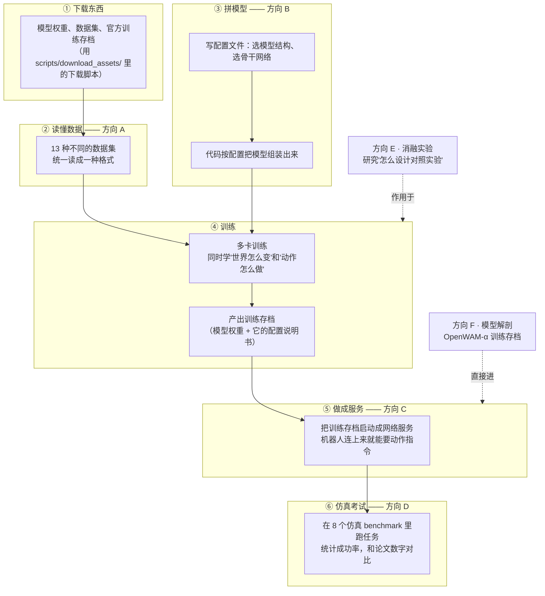

# OpenWAM 调研方向分配说明与任务书（单文件完整版）

> 这份文档带大家拆解 OpenWAM 仓库：它是干什么的、怎么跑起来、每个人负责看懂哪一块。
> 分析对象：OpenWAM-Official/OpenWAM 的 main 分支（提交 `90e94ae`）。
> 在线阅读版（分方向页面）：https://sasasatori.github.io/kaiyuan/ ；分方向源文件在 main 分支 `OpenWAM任务书/` 目录。


## 这份任务书的目标

**最终任务**：学习结束后，组里每个人能独立做到四件事——

1. **搭建 infra**：数据、模型、部署、评测四条管线，每条都能从零搭起来（能新接一个数据集、新加一个模型组件、新起一个服务、新接入一个考场）；
2. **设计消融**：会按"每次只改一个变量"的规矩设计并执行对照实验；
3. **训练**：能跑通从头训练，也能基于官方存档做微调；
4. **部署与评测**：能把训练存档做成网络服务，并在仿真考场里复现论文的成功率。

**阶段性任务**（按顺序推进，每段都有明确产出）：

| 阶段 | 做什么 | 产出 |
|---|---|---|
| 一（第 1–2 周） | 六个方向并行：读代码、写管线讲解、各完成一个动手建造物 | 6 份管线文档；A 的新数据集类型、B 的新模型组件、C 的可请求服务、D 的评测管线总图、E 的可复现验证、F 的存档解剖报告 |
| 二（第 3–5 周） | 各自动手复现：A 跑通数据链路、B 拼模型做组装实验、C 把服务搭起来、D 装好 LIBERO 考场、E 验证实验可复现、F 解剖官方存档 | 服务可用 + LIBERO 考场就绪 |
| 三（第 5–8 周） | 汇合产出：跑评测、做对比、微调 α | LIBERO 成功率对照表 + 一组官方实验模型对比 + α 微调存档 |
| 四（第 8 周以后） | 啃硬骨头 | RoboTwin/EBench 大评测、外接编码器/SVAE、预训练混合攻坚 |

方向之间只有三处需要等别人，且都在第二阶段以后：D 正式评测要等 C 的服务；F 的第 5 个任务要等 C 的服务；E 的第 3 个任务要借 C 和 D 的设施。
---

## 1. 这个仓库是干什么的

OpenWAM 是一个训练"机器人世界模型"的开源项目。它想让模型做两件事：先看懂世界怎么变化（输入视频），再决定机器人该怎么动（输出动作）。仓库里有三样东西：

- **一套积木式框架**：模型、训练、部署、评测都做成了可替换的模块。想换模型结构、换数据集、换评测环境，改配置就行，不用改代码。
- **一批官方消融实验**：官方通过"每次只改一个变量"的对比实验总结了一套设计经验，发布了 34 个实验模型文件（叫 study checkpoint）。
- **一个官方训练好的大模型 OpenWAM-α**：用了 518.5M 帧视频（约 6400 小时，含人拍的第一视角视频和机器人数据）训练，14 个模型文件挂在 HuggingFace 上，可以直接下载来用或继续微调。

论文在 arXiv:2609.07398，代码是 Apache-2.0 协议。

---

## 2. 整个复现流程长什么样

把 OpenWAM 跑起来一共六步，每一步对应一个方向（图里标了归属）：



两个方向的定位比较特殊：

- **方向 E（消融实验）不在这条链上**。它研究的是方法论：官方那 34 个对比实验是怎么设计的，我们怎么照做。
- **方向 F（模型解剖）可以跳过训练**。官方模型文件直接下载就能进第⑤步部署，不用自己训。

训练没有单独设方向：模型怎么拼装归 B，对照实验怎么跑归 E，α 微调归 F。

---

## 3. 六个方向，一人一个

| 方向 | 研究问题 | 什么时候开始需要资源 |
|---|---|---|
| **A · 数据管线** | 搞懂 13 种机器人数据集是怎么被读进来、统一成训练样本的 | 前两周零依赖；之后普通电脑 + LIBERO 数据（1.9GB） |
| **B · 模型管线** | 搞懂模型是怎么"拼"出来的：一份配置文件如何变成可训练的模型 | 前两周零依赖；之后普通电脑（有假模型替代真权重） |
| **C · 部署管线** | 搞懂训练存档怎么变成网络服务，让机器人来问"下一步怎么动" | 前两周零依赖；之后 1 张 24GB 以上显卡 + 一个官方存档（约 25GB） |
| **D · 评测管线** | 搞懂 8 个仿真考试怎么跑，把论文成功率复现出来 | 前两周零依赖；正式评测需要方向 C 先把服务搭好 |
| **E · 消融实验** | 搞懂官方对照实验怎么设计，学会照规矩做对比 | 前两周零依赖；做对比评测时借方向 C/D 的设施 |
| **F · 模型解剖** | 把官方大模型 α 拆开看清楚：里面装了什么、按什么规矩训练、怎么微调 | 前两周零依赖；解剖存档用普通电脑；微调要 4 张 80GB 显卡 |

每个方向的完整任务书（任务清单、步骤、踩坑清单、代码地图）见 `OpenWAM任务书/` 目录下对应文档。任务一览：

- **A**：A1 画数据全流程图｜A2 整理 80 维动作空间对照表｜A3 跑一遍归一化统计生成｜A4 核对下载脚本/读取代码/配置三方对账｜A5 动手写一个最小数据集类型并注册｜A6 调查预训练混合数据能否复现｜A7 给人视角数据缺失下结论
- **B**：B-1 画"配置文件怎么变成模型"全流程图｜B-2 讲清 6 种模型结构 + 核对掩码四模式｜B-3 做骨干×结构可行性表｜B-4 动手给框架加一个新积木｜B-5 搞懂外接视觉编码器怎么接上｜B-6 查清冻结和分组学习率的实际行为
- **C**：C1 下载存档把服务跑起来｜C2 写服务语言手册｜C3 解剖训练存档｜C4 实测两种工作模式谁更快｜C5 验证加速模式结果不变｜C6 逐个试开加速开关｜C7 用 Docker 打包服务（含离线搬运）
- **D**：D1 画"考试怎么进行"全流程图｜D2 先考 LIBERO / LIBERO-plus / RoboCasa365｜D3 考 RoboTwin｜D4 考 VLABench 和 RoboCasa GR1｜D5 考 EBench（先查显卡型号）｜D6 给剩下的考场补 Labtasker 编排
- **E**：E-1 整理官方 34 个实验模型对照表｜E-2 验证同一实验跑两遍结果一致｜E-3 亲手做一组对比评测｜E-4 写测试安全网使用手册｜E-5 做组内实验记录模板
- **F**：F1 开箱解剖官方存档｜F2 整理 80 维动作说明书速查卡｜F3 审计 α 训练配方｜F4 亲手微调一次 α｜F5 部署微调成果并冒烟｜F6 整理 α 家族 14 个成员族谱

人少可以合并：A+F 一组，B+E 一组。

---

## 4. 怎么开展

1. **前两周：读代码 + 写讲解**。每人读自己方向的代码，写一份"这条管线是怎么回事"的文档。不需要 GPU，不需要装环境，今天就能开始。
2. **环境各管各的**。每个方向的文档开头有一张资源清单：需要什么、什么时候需要、怎么下载。没有"全组统一搭环境"这个环节。
3. **两周后组内互讲**。每人 20 分钟，把自己的管线讲给全组听，拼出完整图景。

排期建议（估计）：第 1–2 周并行阅读出 6 份讲解 → 第 3–5 周各自动手（A 跑数据链路、B 拼模型做实验、C 搭服务、D 装 LIBERO 环境、E 验证可复现、F 解剖存档）→ 第 5–8 周汇合出成果（D 跑成功率、E 做对比、F 微调）→ 第 8 周后啃硬骨头（RoboTwin/EBench、预训练数据攻坚）。

方向之间只有三处需要等别人，且都在第二阶段以后：D 正式评测要等 C 的服务；F5 冒烟要等 C 的服务；E3 对比评测要借 C 和 D 的设施。

---

## 5. 容易踩的坑（全组共用）

| # | 坑 | 后果 | 怎么办 |
|---|---|---|---|
| 1 | **官方没发布"人视角视频"那部分数据的读取代码**（代码里只剩注释痕迹） | α 从头预训练无法完整复现 | 以"下载官方存档再微调"为主路线；方向 A/F 会把缺口调查清楚 |
| 2 | 训练很吃显卡：官方记录 2 张 80GB 卡第一步就爆显存 | 低于 4 张 80GB 跑不动正式训练 | 重训类任务提前申请算力；平时用微调和"小模型"路线 |
| 3 | 文档和代码有几处对不上（输出目录参数名、state 维度、注意力掩码默认值） | 照文档操作会报错 | 一律以代码和训练存档里的配置为准 |
| 4 | 仿真器和 CUDA 驱动会打架，考试进程莫名崩溃 | 评测跑到一半挂掉 | 用 `--render-gpus` 把渲染和推理分到不同显卡（方向 D 文档有操作） |
| 5 | EBench 用的 Isaac Sim 4.1.0 不支持 Blackwell 显卡 | 新卡机器跑不了这个考试 | 做 EBench 前先查显卡型号 |
| 6 | Cosmos 骨干要额外编译组件；DINOv3/FLUX.2 权重要先申请授权 | 相关任务会卡住 | 提前一周发起下载和授权申请 |

---

## 6. 常用命令

```bash
# 装环境（普通 Python 路线）
conda create -n openwam python=3.10 && conda activate openwam
pip install torch==2.7.1 torchvision==0.22.1 torchaudio==2.7.1 \
  --index-url https://download.pytorch.org/whl/cu128
pip install -e '.[dev]'

# 跑测试（不需要 GPU，装完先跑这个确认没问题）
make test

# 下载东西（每个脚本都有交互菜单，跟着选就行）
python scripts/download_assets/download_video_backbone.py       # 模型骨干权重
python scripts/download_assets/download_benchmark_data.py       # 各 benchmark 数据集
python scripts/download_assets/download_openwam_checkpoints.py  # 官方训练存档
python scripts/download_assets/download_vlm_backbone.py         # 三系统架构才需要的语言模型
python scripts/download_assets/download_visual_encoder.py       # 外部视觉编码器

# 训练（先跑 20 步调试模式，确认能跑通再正式训）
bash scripts/train.sh dataloader=libero model=dual_system \
  model/video_backbone=wan22_ti2v_5b model.architecture.variant=joint_self_attn \
  model.architecture.attention_mask_mode=mutual training.debug=true

# 微调官方模型
bash scripts/train.sh dataloader=libero training.finetune_ckpt_path=<官方存档目录>

# 把训练存档做成服务，然后发一个测试请求
bash scripts/deploy.sh <存档目录>
python scripts/inference_test/inference_single_test.py --server ws://127.0.0.1:8848 --test --state-dim <维度>
```

**仓库自带的官方文档**（在 `assets/openwam_usage_docs/` 和 `benchmarks/` 下）：

- `train-and-deploy.md`：怎么训练、怎么部署
- `architecture-extension.md`：怎么给框架加新的模型组件（方向 B 要用）
- `benchmark-integration.md`：怎么接入新的数据集和 benchmark（方向 A 要用）
- `openwam-alpha-finetuning.md`：α 微调官方说明（方向 F 必读）
- `docker.md`：Docker 安装和离线部署（方向 C 要用）
- `benchmarks/README.md`：评测客户端总指南（方向 D 必读）

---

## 7. 附录：速查表

### 7.1 六种模型结构（详细讲解在方向 B 文档）

| 结构 | 一句话区别 | 上手难度 |
|---|---|---|
| single_system / vanilla | 动作直接接在视频后面一起算 | 中 |
| single_system / moe | 同上，但中间几层换成"混合专家"（一组子网络每次挑几个算） | 中 |
| dual_system / joint_cross_attn | 先算完视频，再把中间结果交给动作模块 | 中-高 |
| dual_system / joint_self_attn | 视频和动作各算各的，每一层互相看一眼 | 中-高 |
| dual_system / idm | 分两步：先想象未来画面，再决定动作 | 高 |
| tri_system / joint_self_attn | 在上面基础上加一个冻结的语言模型当"顾问" | 高 |

### 7.2 骨干网络（详细讲解在方向 B 文档）

| 骨干 | 大小 | 权重大小 | 好不好拿 |
|---|---|---|---|
| Wan2.2-TI2V-5B（默认） | 5B | 34.2 GB | 好拿（HF/ModelScope 直接下） |
| Wan2.1-VACE-1.3B | 1.3B | 19.0 GB | 好拿 |
| Wan2.1-I2V-14B-480P | 14B | 82.3 GB | 好拿但很大 |
| Cosmos-Predict2.5-2B | 2B | 约 21 GB | 难：要编译额外组件 |
| Cosmos3-Edge | 4B | 9.2 GB | 难：环境坑最多 |
| 外接编码器（DINOv3 / V-JEPA2.1 / 两种 VAE） | — | 0.4–16.9 GB | 两个要先申请授权；接了就必须从头训练 |
| Qwen3-VL-2B（tri 结构专用） | 2B | 4.3 GB | 好拿 |

### 7.3 数据集（详细讲解在方向 A 文档）

| 数据集 | 多大 | 好不好拿 |
|---|---|---|
| LIBERO | 1.9 GB | 一键下载 |
| VLABench | 13.2 GB | 一键下载 |
| RoboCasa_GR1 | 43.9 GB | 一键下载 |
| RoboCasa365 | 78 GB | 一键下载 |
| EBench | 305 GB | 能下但大 |
| RoboTwin2.0 | 415 GB | 能下但大 |
| RoboDojo（仿真/真机） | 488/255 GB | 能下但大 |
| 预训练混合（4 个机器人数据源） | 数百 GB | 难：没有下载脚本，要手工准备；人视角部分官方根本没发布 |

### 7.4 八个考场（详细讲解在方向 D 文档）

| 考场 | 用什么仿真器 | 多少题 | 环境好不好装 |
|---|---|---|---|
| LIBERO | MuJoCo | 4 组 × 10 题 × 50 次 | 好装（一键脚本） |
| LIBERO-plus | MuJoCo | 同上加 7 类扰动 | 较好装 |
| RoboCasa365 | MuJoCo | 50 题 | 较好装 |
| RoboCasa GR1 | MuJoCo | 24 题 | 要手工装 |
| VLABench | MuJoCo | 6 个赛道 / 10 个基础任务 | 要手工装 |
| RoboTwin | SAPIEN | 50 题 × 2 模式 × 100 次 | 难装（版本卡得死） |
| EBench | Isaac Sim | 26 题 × 20 次 | 难装，还挑显卡 |
| RoboDojo | 外部系统 | 42 题 | 评测完全在外部仓库 |

### 7.5 资源底线

| 场景 | 最低 | 推荐 | 说明 |
|---|---|---|---|
| 训练 | 4 张 80GB 显卡 | 8 张 80GB | 官方记录 2 张第一步就爆显存 |
| 部署/推理 | 1 张 24GB 显卡 | 1 张 40GB+ | 第一次请求有编译预热，会慢 |
| 磁盘 | 60GB（Docker 构建） | 越多越好 | 每个官方存档约 25GB |
| 跑测试 | 普通电脑 | — | 不需要 GPU 和权重 |

---

## 8. 这份任务书是怎么来的

对仓库做了 8 路并行代码调研（模型结构、骨干网络、训练、数据、部署、评测、基础设施、测试），关键结论都经过源码核对（比如"官方没发布人视角数据读取代码"这条，是全局搜索验证过的）。
