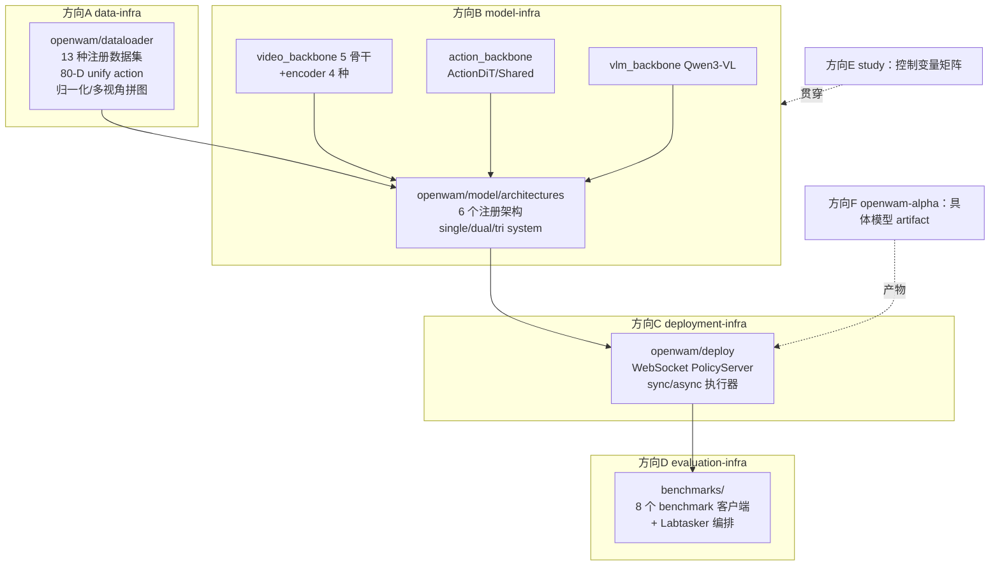
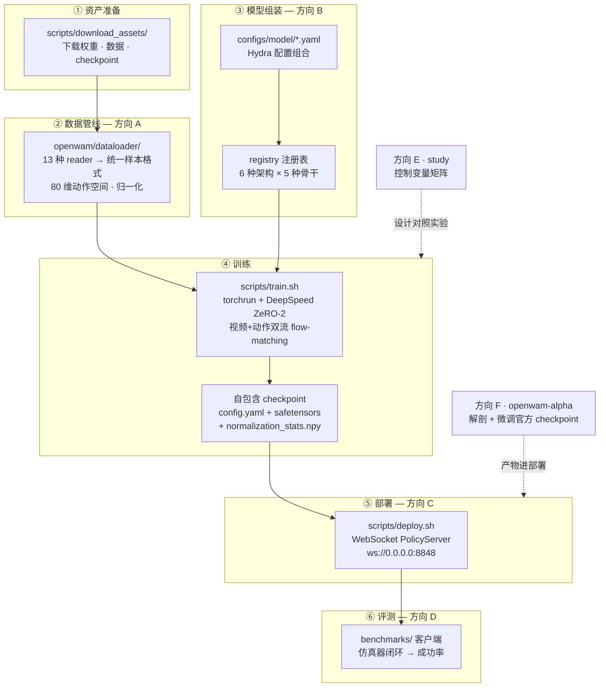
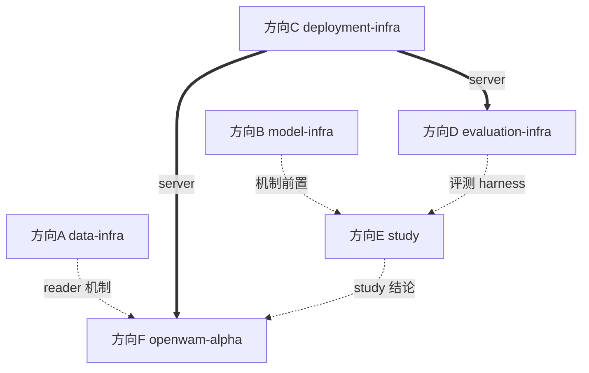

# OpenWAM 调研方向分配说明与任务书（母文档）

> 日期：2026-09-23
> 分析对象：`OpenWAM-Official/OpenWAM` @ `main` `90e94ae`
> 分析方法：8 路并行只读调研（架构/骨干/训练/数据/部署/评测/基建/测试），关键结论已经交叉核验（含源码 grep 复核）。
> 使用方式：§1–§2 为全组共享背景；§3 为方向总表；§4 为各方向任务书摘要（**完整任务书在 `OpenWAM任务书/` 分方向文档与在线站点 https://sasasatori.github.io/kaiyuan/**）；§5 排期与依赖；§6 风险登记；§7 命令速查。

---

## 1. 仓库全景

### 1.1 项目定位

OpenWAM 是一个 **World–Action Model（WAM）系统预训练研究栈**，由三部分组成：

- **OpenWAM-Infra**：模块化基础设施——模型（架构×骨干）、训练、推理部署、评测全部可组合替换；
- **OpenWAM-Study**：受控消融实验体系（官方已发布 34 个 study checkpoint）；
- **OpenWAM-α**：在 518.5M 帧（约 6400 小时，egocentric human + robot）上预训练的开放基础模型（14 个 alpha checkpoint 已发布 HuggingFace）。

论文：arXiv:2609.07398；权重/数据：huggingface.co/OpenWAM；协议：Apache-2.0。

### 1.2 模块地图与六管线划分



依赖方向严格单向：`architecture → backbones`；评测层为「薄客户端 + 厚服务端」。

### 1.3 端到端复现主干与工作方式

一次完整复现的六个阶段及各阶段归属方向：



方向 E、F 是横切方向：E 的对照实验作用于训练阶段，F 的 checkpoint 直接进入部署。训练不单独设方向——模型组装归 B，对照实验归 E，alpha 微调归 F。

工作方式：

1. **前两周（W1–W2）全员纯阅读 + 写文档**，零 GPU、零环境依赖，今天就能开工；
2. **环境各管各的**：每个方向文档的 §0 写清它自己需要什么资源、哪个阶段需要、怎么获取，没有"全组统一搭环境"环节；
3. 跨方向硬依赖只有三处（D 评测需 C 的 server、F5 需 C 的 server、E3 需 C+D），全部在第二阶段才出现。

---

## 2. 关键事实速查

### 2.1 架构家族（6 个注册架构，`openwam/model/architectures/`）

| framework | variant | 注册名 | 机制要点 | 复现难度 |
|---|---|---|---|---|
| single_system | vanilla | single_system_vanilla | 动作 token 拼进视频 DiT 序列 | 中 |
| single_system | moe | single_system_moe | bridge 层上加 expert FFN 残差 | 中 |
| dual_system | joint_cross_attn | dual_system_cross_attn | 视频跑完→bridge 特征→ActionDiT 交叉注意力；`detach_bridge` 控梯度回传 | 中-高 |
| dual_system | joint_self_attn | dual_system_self_attn | 逐层 MoT 混合自注意力（几何需与视频 DiT 严格对齐） | 中-高 |
| dual_system | idm | dual_system_idm | 逆动力学式 teacher-forcing 训练 + 两阶段推理（视频 KV 缓存→动作循环） | 高 |
| tri_system | joint_self_attn | tri_system_joint_self_attn | 加冻结 Qwen3-VL 理解专家进联合注意力（只读尾） | 高 |

注意力可见性：`attention_mask_mode ∈ {mutual, action_sees_video, video_sees_action, isolated}`（yaml 默认 mutual；**代码默认 action_sees_video，两处不一致**）；`video_attention_mask_mode ∈ {first_frame_causal, per_frame_causal, bidirectional}`。

### 2.2 骨干网络（`openwam/model/{video,action,vlm}_backbone/`）

| 骨干 | 几何（dim/层/头） | 权重体积 | 获取 | 复现难度 |
|---|---|---|---|---|
| Wan2.2-TI2V-5B（默认） | 3072/30/24 | 34.2 GB | HF/ModelScope | 低 |
| Wan2.1-VACE-1.3B | 1536/30/12 | 19.0 GB | HF/ModelScope | 低-中（与外部 encoder 互斥） |
| Wan2.1-I2V-14B-480P | 5120/40/40 | 82.3 GB | HF/ModelScope | 中 |
| Cosmos-Predict2.5-2B | 2048/28/16 | 4.6+16.6 GB(Reason1) | HF | 高（submodule+编译 transformer-engine） |
| Cosmos3-Edge | 2048/28/16 | 9.2 GB | HF/ModelScope | 高（vendored transformer，坑最多） |
| 外部 encoder：Wan2.2 VAE / FLUX.2 VAE / DINOv3 ViT-B / V-JEPA2.1 ViT-G | — | 2.9/0.4/0.4/16.9 GB | DINOv3、FLUX.2 为 HF gated；V-JEPA 为官方直链 | 中-高（**必须 from_scratch=true 重训 DiT**） |
| Qwen3-VL-2B-Instruct（tri 专用） | — | 4.3 GB | HF | 中 |

动作侧：`ActionDiT`（dual/tri，dim=1024/ffn=4096）与 `SharedActionBackbone`（single）两套互不相同的 ABC；flow-matching 由 `ActionScheduler`（移位 sigmoid）实现。**注意：仓库无 LAPA/latent-action 模块**（README 提及但代码缺席，已核验）。

### 2.3 数据集（13 个注册类型，`openwam/dataloader/`）

统一契约：canonical sample `{video: [PIL], action: (T,80)+mask, proprio: (T,80)+mask, prompt: str}`；异构机器人经 **80-D unified action space + 逐维 bool mask** 对齐；归一化 `min-max|z-score|quantile`（clip 到 [-1,1]，rot6d 恒等钉住）。

| 数据集 | 格式 | 体量 | 获取难度 |
|---|---|---|---|
| LIBERO | LeRobot v3 | 1.9 GB | 低（下载器一键） |
| VLABench | LeRobot v3 | 13.2 GB | 低 |
| RoboCasa365 | LeRobot v3 | 78 GB | 低 |
| RoboCasa_GR1 | LeRobot v3 | 43.9 GB | 低 |
| RoboTwin2.0 | HDF5 | 415 GB | 中 |
| EBench | LeRobot v2.1 | 305 GB | 中 |
| RoboDojo (sim/real) | HDF5 | 488/255 GB | 中 |
| 预训练混合：AgiBotWorld / RoboCOIN / InternData-A1 / OXE-DROID | LeRobot v3 | 数百 GB | **高（无下载脚本，手工挂载 + exclusion/trim 制品）** |

**已核验缺口**：README 宣称的 egocentric human 源（EgoDex/Ego4D）reader **未随仓库发布**（仅有 docstring 残留引用，registry 无注册）→ **OpenWAM-α 预训练数据混合无法完整复现**，这是本仓库最大的复现边界。

### 2.4 Benchmark 对比（`benchmarks/`）

| Benchmark | 仿真器 | 任务规模 | 环境难度 | 评测时长线索 |
|---|---|---|---|---|
| LIBERO | MuJoCo3.3.2+robosuite1.4.0 | 4 suites×10 tasks×50 trials | 低-中（一键 setup_env.sh） | max_steps 600/700 |
| LIBERO-plus | 同上+扰动资产 | 4 suites，7 类扰动 | 中 | 同上 |
| RoboCasa365 | robosuite+MuJoCo3.3.1 | 50 target tasks | 中（一键脚本） | 官方 horizon |
| RoboCasa GR1 | robosuite1.5.1+MuJoCo3.2.6 | 24 个 gr1_unified env | 中-高（无 setup 脚本） | max_steps 720 |
| VLABench | MuJoCo3.2.2+dm_control | 6 tracks/10 primitive | 中-高 | 每任务 30–60 min |
| RoboTwin | SAPIEN3.0.0b1+cuRobo+mplib | 50 tasks×2 模式×100 ep | 高（版本强耦合） | 多 GPU-小时/模式 |
| EBench | Isaac Sim 4.1.0（不支持 Blackwell） | test_mini 26 tasks×20 ep | 高 | 步预算 600–5000/任务 |
| RoboDojo | 外部 XPolicyLab（Isaac） | 42 tasks | 高（评测完全外部） | 每任务 50 ep |

### 2.5 资源底线（来自代码与官方验证记录）

| 场景 | 最低 | 推荐 | 备注 |
|---|---|---|---|
| 训练（Wan2.2-5B 全架构） | 4×80GB（batch=1+ZeRO-2+grad-ckpt；2 卡 OOM，官方记录） | 8×80GB | 可训参数 ~6.02B；resume state >100 GiB |
| 部署/推理 | 单卡 ≥24GB（5B bf16） | 单卡 40GB+ | 首次请求有 torch.compile 预热 |
| 磁盘 | Docker 构建 60GB；镜像 ~25GB | 每 checkpoint ~25GB；数据见 §2.3 | alpha ckpt 14 个、study ckpt 34 个 |
| CPU 测试 | 无 GPU 无权重即可 | — | `make test`（CI 等价） |

---

## 3. 方向分配总表

| 方向 | 文档（`OpenWAM任务书/` 下） | 研究问题 | 动手起点 | 外部依赖 |
|---|---|---|---|---|
| **A** | 方向A-Data-Infra数据管线.md | 数据管线如何搭建：13 种异构数据 → 一种训练样本 | 读代码 → CPU + LIBERO(1.9GB) | 无 |
| **B** | 方向B-Model-Infra模型管线.md | 模型模块化管线如何搭建：yaml → registry → 架构×骨干 | 读代码 → CPU（mock backbone） | 无 |
| **C** | 方向C-Deployment-Infra部署管线.md | 部署管线如何搭建：自包含 checkpoint → WebSocket server | 读代码 → 1×≥24GB GPU + 1 checkpoint | 无 |
| **D** | 方向D-Evaluation-Infra评测管线.md | 评测管线如何搭建：薄客户端+厚服务端，8 大 benchmark | 读代码 → 方向C的 server + 各仿真器 env | C（仅评测阶段） |
| **E** | 方向E-Study消融实验实现.md | 受控消融如何实现：实验矩阵、确定性、对照方法论 | 读代码 → CPU；对比评测时借 C/D | C/D（仅 E3） |
| **F** | 方向F-OpenWAM-Alpha模型实现.md | α 模型实现：配置链、80 维契约、预训练配方、微调路径 | 读代码 → 1 checkpoint 考古（CPU 可） | C（仅 F5） |

建议分工（6 人最佳；人少可合并 A+F、B+E）：每人一条管线，W1–W2 各自产出管线搭建文档后组内互讲。

---

## 4. 各方向任务书摘要

> 完整任务书（含命令级步骤、验收标准、代码锚点、风险坑、推荐阅读顺序）见 `OpenWAM任务书/` 分方向文档；在线版：https://sasasatori.github.io/kaiyuan/

### 方向 A — Data-Infra（数据管线搭建）
A1 数据管线搭建全景指南（registry→reader→canonical sample→transforms→train 入口）｜A2 80-D unified action space 语义总表｜A3 归一化统计链路复现｜A4 下载器↔reader↔config 对账｜A5 动手搭建：合成数据最小 reader 注册并跑通 build_dataset｜A6 预训练混合可复现性攻坚（机制侧）｜A7 egocentric human 源定位结论（EgoDex 缺席证据链）

### 方向 B — Model-Infra（模型模块化管线搭建）
B-1 模型组装链路全景文档化（Hydra 组→registry→build_architecture→freeze）｜B-2 6 注册架构+三族耦合范式+mask 四模式核对｜B-3 骨干×架构可行性矩阵（5×6）｜B-4 动手搭建：按 architecture-extension.md 扩展最小 backbone/architecture｜B-5 外部 encoder 接入机制复现（构建级）｜B-6 freeze 策略与优化器分组审计

### 方向 C — Deployment-Infra（部署管线搭建）
C1 最小部署复现（下载 ckpt→deploy.sh→客户端冒烟）｜C2 WebSocket 协议契约文档｜C3 自包含 checkpoint 格式与加载链审计｜C4 sync/async 执行器延迟实测｜C5 denoise_schedule 等价性验证｜C6 优化开关消融（dit_cache/compile 等）｜C7 Docker serve 与离线交付演练

### 方向 D — Evaluation-Infra（评测管线搭建）
D1 评测管线拓扑文档化（客户端/服务端/协议/动作转换/Labtasker 三件套）｜D2 第一梯队：LIBERO 全 4 suite + LIBERO-plus 扰动 + RoboCasa365｜D3 RoboTwin 端到端｜D4 VLABench 6 track + RoboCasa GR1｜D5 EBench（mock→完整，先核对 GPU 代际）｜D6 Labtasker 横向推广

### 方向 E — Study（消融实验实现）
E1 Study 实验矩阵考古（旋钮 ↔ 34 个 study checkpoint 对账）｜E2 控制变量的确定性基础（seeding 体系 + debug 模式，逐位一致验证）｜E3 复现一组官方消融（同组两个 study checkpoint 对比评测，省算力路线）｜E4 测试不变量作为实验安全网使用手册｜E5 实验追踪与记录规范模板

### 方向 F — OpenWAM-α（模型实现）
F1 alpha checkpoint 考古（解剖 config.yaml + safetensors 键结构）｜F2 80 维 action/state 契约速查卡｜F3 alpha 预训练配方审计（mixture.yaml 4 源 + 518.5M 帧差距 + EgoDex 缺口）｜F4 alpha 微调复现（finetune_ckpt_path 路径）｜F5 alpha 部署与基准冒烟｜F6 alpha 家族谱系整理（14 个 checkpoint）

---

## 5. 依赖关系与排期建议（估计）



| 阶段 | 周（估计） | 全员动作 | 里程碑产出 |
|---|---|---|---|
| M1 | W1–W2 | 六方向并行纯阅读：各自完成管线搭建文档（各文档 §4 前 1–2 个任务） | 6 份管线文档 + 组内互讲 |
| M2 | W3–W5 | 各自动手：A 数据链路、B 组装矩阵/扩展冒烟、C 起 server、D 备 LIBERO env、E 确定性验证、F checkpoint 考古 | server 可用 + LIBERO 环境就绪 |
| M3 | W5–W8 | 汇合：D 跑 LIBERO 评测、E 做 checkpoint 对比、F 微调 alpha、A/C 纵深任务 | 首批复现数字 + 对照实验 |
| M4 | W8+ | 高阶项：RoboTwin/EBench、encoder/SVAE、预训练混合攻坚 | 完整复现报告 |

---

## 6. 风险登记册（各方向文档 §6 有展开与代码锚点）

| # | 风险/缺口 | 影响 | 归属方向 |
|---|---|---|---|
| R1 | **预训练数据混合不完整**：egocentric human（EgoDex/Ego4D）reader 未发布（`openwam/dataloader/registry.py:91-106` 无注册，仅 docstring 残留）；`configs/dataloader/pretrain_data/` 全是 `/path/to` 占位 | OpenWAM-α 从头预训练**不可完整复现** | A（A7）/ F（F3） |
| R2 | LAPA/latent-action 工具链缺席（README 提及，代码零命中，已核验） | latent action 方向无仓库支撑 | B |
| R3 | 算力门槛：训练最低 4×80GB | 重训类任务需专项申请 | F / E |
| R4 | CI 无 GPU/模型覆盖 | "CI 绿" ≠ "复现可行" | 全员 |
| R5 | 文档/代码不一致多处：`project.output_dir`、`--state-dim`、`attention_mask_mode` 默认值 | 按文档操作会踩坑；以代码与 checkpoint 内 `config.yaml` 为准 | B / C / F |
| R6 | EBench 的 Isaac Sim 4.1.0 不支持 Blackwell GPU | D5 完整评测需先核对 GPU 代际 | D |
| R7 | RoboTwin prompt 模板双份维护（靠测试钉住逐字节一致） | 单侧改动 → 静默分布偏移 | D / A |
| R8 | EGL×CUDA 驱动冲突（MuJoCo 系，exit=-6） | 评测进程随机崩溃；`--render-gpus` 隔离 | D |
| R9 | Cosmos 需 submodule（当前为空）+ 编译 transformer-engine；DINOv3/FLUX.2 为 HF gated | 相关任务启动前一周发起 | B |
| R10 | `Wan21` 一类两名，加载由 `model_path` 决定，失配仅 WARN | 静默加载错骨干 | B / F |

---

## 7. 附录：命令速查

```bash
# ---- 环境（Native 路线；Docker 见方向C §0）----
conda create -n openwam python=3.10 && conda activate openwam
pip install torch==2.7.1 torchvision==0.22.1 torchaudio==2.7.1 \
  --index-url https://download.pytorch.org/whl/cu128
pip install -e '.[dev]'               # deepspeed 现场编译需 gcc

# ---- 测试门禁（各方向共用的最低验证）----
make test                             # CPU 核心集（CI 等价）

# ---- 资产下载（均有 --name/--yes 非交互模式）----
python scripts/download_assets/download_video_backbone.py
python scripts/download_assets/download_benchmark_data.py
python scripts/download_assets/download_openwam_checkpoints.py  # alpha 14 + study 34
python scripts/download_assets/download_vlm_backbone.py
python scripts/download_assets/download_visual_encoder.py

# ---- 训练 / 部署 / 推理 ----
bash scripts/train.sh dataloader=libero model=dual_system \
  model/video_backbone=wan22_ti2v_5b model.architecture.variant=joint_self_attn \
  model.architecture.attention_mask_mode=mutual training.debug=true   # 20 步冒烟
bash scripts/train.sh dataloader=libero \
  training.finetune_ckpt_path=<foundation_ckpt_dir>                   # α 微调
bash scripts/deploy.sh <ckpt_dir>                                     # ws://0.0.0.0:8848
python scripts/inference_test/inference_single_test.py --server ws://127.0.0.1:8848 --test --state-dim <N>

# ---- Cosmos 可选依赖（方向B 相关任务才需要）----
git submodule update --init third_party/cosmos-predict2.5
bash scripts/install_cosmos_predict25.sh
```

**文档索引（仓库内维护的权威指南）**：
- `assets/openwam_usage_docs/train-and-deploy.md` — 训练与部署
- `assets/openwam_usage_docs/architecture-extension.md` — 架构/骨干扩展约定（方向B B-4 的依据）
- `assets/openwam_usage_docs/benchmark-integration.md` — benchmark/dataloader 接入（方向A A5 的依据）
- `assets/openwam_usage_docs/openwam-alpha-finetuning.md` — α 微调（方向F F2 的权威来源）
- `assets/openwam_usage_docs/docker.md` — Docker/离线部署（方向C C7）
- `benchmarks/README.md` — 客户端接入总指南（方向D D1）
- `benchmarks/{robotwin,libero}/LABTASKER.md` — Labtasker 分布式评测
