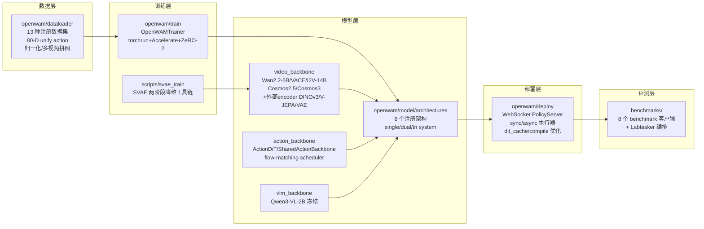
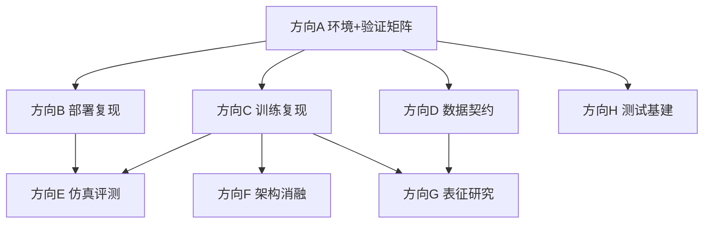

# OpenWAM 调研方向分配说明与任务书

> 版本：v1.0（2026-09-23）
> 分析对象：`OpenWAM-Official/OpenWAM` @ `main` `90e94ae`
> 分析方法：8 路并行只读调研（架构/骨干/训练/数据/部署/评测/基建/测试），关键结论已经交叉核验（含源码 grep 复核）。
> 使用方式：§1–§2 为全组共享背景；§3 为方向总表；§4 为各方向任务书（可直接发给对应同学）；§5 排期与依赖；§6 风险登记；§7 命令速查。

---

## 1. 仓库全景

### 1.1 项目定位

OpenWAM 是一个 **World–Action Model（WAM）系统预训练研究栈**，由三部分组成：

- **OpenWAM-Infra**：模块化基础设施——模型（架构×骨干）、训练、推理部署、评测全部可组合替换；
- **OpenWAM-Study**：受控消融实验体系（官方已发布 34 个 study checkpoint）；
- **OpenWAM-α**：在 518.5M 帧（约 6400 小时，egocentric human + robot）上预训练的开放基础模型（14 个 alpha checkpoint 已发布 HuggingFace）。

论文：arXiv:2609.07398；权重/数据：huggingface.co/OpenWAM；协议：Apache-2.0。

### 1.2 模块地图



依赖方向严格单向：`architecture → backbones`（backbone 禁止反向 import）；评测层为「薄客户端 + 厚服务端」，客户端只讲 WebSocket 线协议。

### 1.3 端到端链路（复现主干）

```
环境(Docker/native) → 下载器(权重+数据) → train.sh(torchrun) → OpenWAMTrainer
  → checkpoint(自包含: config.yaml + safetensors + normalization_stats)
  → deploy.sh(PolicyServer, ws://:8848) → benchmark 客户端(仿真器) → 成功率
```

---

## 2. 关键事实速查

### 2.1 架构家族（6 个注册架构，`openwam/model/architectures/`）

| framework | variant | 注册名 | 机制要点 | 复现难度 |
|---|---|---|---|---|
| single_system | vanilla | single_system_vanilla | 动作 token 拼进视频 DiT 序列 | 中 |
| single_system | moe | single_system_moe | bridge 层上加 expert FFN 残差 | 中 |
| dual_system | joint_cross_attn | dual_system_cross_attn | 视频跑完→bridge 特征→ActionDiT 交叉注意力；`detach_bridge` 控梯度回传 | 中-高 |
| dual_system | joint_self_attn | dual_system_self_attn | 逐层 MoT 混合自注意力（几何需与视频 DiT 严格对齐） | 中-高 |
| dual_system | idm | dual_system_idm | 逆动力学式 teacher-forcing 训练 + 两阶段推理（视频 KV 缓存→动作循环） | 高 |
| tri_system | joint_self_attn | tri_system_joint_self_attn | 加冻结 Qwen3-VL 理解专家进联合注意力（只读尾） | 高 |

注意力可见性：`attention_mask_mode ∈ {mutual, action_sees_video, video_sees_action, isolated}`（yaml 默认 mutual；**代码默认 action_sees_video，两处不一致**）；`video_attention_mask_mode ∈ {first_frame_causal, per_frame_causal, bidirectional}`。

### 2.2 骨干网络（`openwam/model/{video,action,vlm}_backbone/`）

| 骨干 | 几何（dim/层/头） | 权重体积 | 获取 | 复现难度 |
|---|---|---|---|---|
| Wan2.2-TI2V-5B（默认） | 3072/30/24 | 34.2 GB | HF/ModelScope | 低 |
| Wan2.1-VACE-1.3B | 1536/30/12 | 19.0 GB | HF/ModelScope | 低-中（与外部 encoder 互斥） |
| Wan2.1-I2V-14B-480P | 5120/40/40 | 82.3 GB | HF/ModelScope | 中 |
| Cosmos-Predict2.5-2B | 2048/28/16 | 4.6+16.6 GB(Reason1) | HF | 高（submodule+编译 transformer-engine） |
| Cosmos3-Edge | 2048/28/16 | 9.2 GB | HF/ModelScope | 高（vendored transformer，坑最多） |
| 外部 encoder：Wan2.2 VAE / FLUX.2 VAE / DINOv3 ViT-B / V-JEPA2.1 ViT-G | — | 2.9/0.4/0.4/16.9 GB | DINOv3、FLUX.2 为 HF gated；V-JEPA 为官方直链 | 中-高（**必须 from_scratch=true 重训 DiT**） |
| Qwen3-VL-2B-Instruct（tri 专用） | — | 4.3 GB | HF | 中 |

动作侧：`ActionDiT`（dual/tri，dim=1024/ffn=4096）与 `SharedActionBackbone`（single）两套互不相同的 ABC；flow-matching 由 `ActionScheduler`（移位 sigmoid）实现。**注意：仓库无 LAPA/latent-action 模块**（README 提及但代码缺席，已核验）。

### 2.3 数据集（13 个注册类型，`openwam/dataloader/`）

统一契约：canonical sample `{video: [PIL], action: (T,80)+mask, proprio: (T,80)+mask, prompt: str}`；异构机器人经 **80-D unified action space + 逐维 bool mask** 对齐；归一化 `min-max|z-score|quantile`（clip 到 [-1,1]，rot6d 恒等钉住）。

| 数据集 | 格式 | 体量 | 获取难度 |
|---|---|---|---|
| LIBERO | LeRobot v3 | 1.9 GB | 低（下载器一键） |
| VLABench | LeRobot v3 | 13.2 GB | 低 |
| RoboCasa365 | LeRobot v3 | 78 GB | 低 |
| RoboCasa_GR1 | LeRobot v3 | 43.9 GB | 低 |
| RoboTwin2.0 | HDF5 | 415 GB | 中 |
| EBench | LeRobot v2.1 | 305 GB | 中 |
| RoboDojo (sim/real) | HDF5 | 488/255 GB | 中 |
| 预训练混合：AgiBotWorld / RoboCOIN / InternData-A1 / OXE-DROID | LeRobot v3 | 数百 GB | **高（无下载脚本，手工挂载 + exclusion/trim 制品）** |

**已核验缺口**：README 宣称的 egocentric human 源（EgoDex/Ego4D）reader **未随仓库发布**（仅有 docstring 残留引用，registry 无注册）；`configs/dataloader/pretrain_data/` 全部使用 `/path/to/pretrain_dataset` 占位 → **OpenWAM-α 预训练数据混合无法完整复现**，这是本仓库最大的复现边界。

### 2.4 Benchmark 对比（`benchmarks/`，客户端-服务端 WebSocket 架构）

| Benchmark | 仿真器 | 任务规模 | 环境难度 | 评测时长线索 |
|---|---|---|---|---|
| LIBERO | MuJoCo3.3.2+robosuite1.4.0 | 4 suites×10 tasks×50 trials | 低-中（一键 setup_env.sh） | max_steps 600/700 |
| LIBERO-plus | 同上+扰动资产 | 4 suites，7 类扰动 | 中 | 同上 |
| RoboCasa365 | robosuite+MuJoCo3.3.1 | 50 target tasks | 中（一键脚本） | 官方 horizon |
| RoboCasa GR1 | robosuite1.5.1+MuJoCo3.2.6 | 24 个 gr1_unified env | 中-高（无 setup 脚本） | max_steps 720 |
| VLABench | MuJoCo3.2.2+dm_control | 6 tracks/10 primitive | 中-高 | 每任务 30–60 min |
| RoboTwin | SAPIEN3.0.0b1+cuRobo+mplib | 50 tasks×2 模式×100 ep | 高（版本强耦合） | 多 GPU-小时/模式 |
| EBench | Isaac Sim 4.1.0（不支持 Blackwell） | test_mini 26 tasks×20 ep | 高 | 步预算 600–5000/任务 |
| RoboDojo | 外部 XPolicyLab（Isaac） | 42 tasks | 高（评测完全外部） | 每任务 50 ep |

已知环境坑：MuJoCo EGL × CUDA 驱动冲突（LIBERO 系需 `--render-gpus` 物理隔离）；RoboTwin 依赖钉死（torch 2.4.1/cuRobo 0.7.8/warp 1.13）且需 monkeypatch 上游 eval 脚本。

### 2.5 资源底线（来自代码与官方验证记录）

| 场景 | 最低 | 推荐 | 备注 |
|---|---|---|---|
| 训练（Wan2.2-5B 全架构） | 4×80GB（batch=1+ZeRO-2+grad-ckpt；2 卡 OOM，官方记录） | 8×80GB | 可训参数 ~6.02B；resume state >100 GiB |
| 部署/推理 | 单卡 ≥24GB（5B bf16） | 单卡 40GB+ | 首次请求有 torch.compile 预热 |
| 磁盘 | Docker 构建 60GB；镜像 ~25GB | 每 checkpoint ~25GB；数据见 §2.3 | alpha ckpt 14 个、study ckpt 34 个 |
| CPU 测试 | 无 GPU 无权重即可 | — | `make test`（CI 等价） |

---

## 3. 方向分配总表

| 方向 | 名称 | 性质 | 难度 | 前置 | 建议投入 |
|---|---|---|---|---|---|
| **A** | 环境搭建与验证矩阵 | 公共前置（复现） | 低-中 | 无 | 1 人，第 1–2 周（全组阻塞依赖） |
| **B** | 部署与推理复现 | 复现+测量 | 低-中 | A + 下载 1 个 checkpoint | 1 人 |
| **C** | 训练管线复现 | 复现 | 中 | A + LIBERO 数据 + Wan2.2-5B | 1 人 |
| **D** | 数据管线与动作空间 | 调研+文档 | 低-中（D5/D6 高） | A | 1 人 |
| **E** | 仿真评测复现 | 复现（可拆 E1/E2/E3） | 中-高 | A + B | 1–2 人 |
| **F** | 架构变体与注意力机制研究 | 研究（消融） | 中-高 | C 跑通后 | 1 人 |
| **G** | 视觉表征与骨干研究 | 研究（消融） | 高 | C 跑通后 + 额外权重 | 1 人 |
| **H** | 测试与质量基建 | 贯穿（可选） | 低 | A | 0.5 人（轮值） |

建议节奏：A 是所有人的硬前置；B/C/D 第二周并行启动；E 依赖 B（需部署好的 server）；F/G 依赖 C（需可训练环境）。

---

## 4. 各方向任务书

### 方向 A：环境搭建与验证矩阵（公共前置）

**背景**：仓库工程化程度高——Docker 五阶段镜像（CUDA 12.8.1 digest 钉死 + uv 锁文件 + Ubuntu snapshot apt）、CPU 测试门禁（`make test` ≈ CI）、离线 bundle 交付（offline.py schema-4）。但 CI 不覆盖 GPU/模型路径，`docker-validation.md` 诚实列出了未验证项。

**目标**：搭好全组共享的可用环境，产出"什么能跑、什么不能跑"的权威验证矩阵。

| 编号 | 任务 | 验收标准 | 难度 |
|---|---|---|---|
| A1 | Docker 路线搭建：`make docker-build` → `docker-check` → `docker-integration-check` → `gpu-check`（含多卡 NCCL） | 全部通过；记录耗时与磁盘占用 | 中 |
| A2 | Native 路线搭建（conda+torch2.7.1+cu128+`pip install -e .[dev]`），作为对比 | `make test` 全绿 | 中 |
| A3 | CPU 验证矩阵：跑 `make test`（`pytest -m "not gpu"`），统计 pass/skip，产出 GPU 层 skip 说明表 | 全绿；skip 原因逐项标注（缺 diffusers/labtasker/权重/env 开关） | 低 |
| A4 | 架构不变量门禁复现：单独跑 `test_split_attn_equivalence`（零 atol 拆分注意力等价）、`test_train_deploy_consistency`、`test_save_deploy_assets_hook`、`test_no_execution_plan`，并做一次"故意破坏→变红"对照 | 4 项全过 + 1 个破坏对照实验记录 | 低-中 |
| A5 | 资产下载演练：逐个跑 5 个下载器（video_backbone/benchmark_data/visual_encoder/vlm_backbone/openwam_checkpoints），核对 yaml 回写字段与 normalization stats 生成 | 支持矩阵表（模型×源×体积×回写字段）+ 实际下载验证 | 中 |
| A6 | 已知坑验证：H100/同级卡上确认 `NCCL_RAS_ENABLE=0`、`NCCL_NVLS_ENABLE=0` workaround；记录本组 GPU 型号的适配结论 | 排障记录并入组内 wiki | 中 |

**产出**：环境搭建 SOP（Docker/native 双路线）、验证矩阵表、资产清单表、排障 wiki。
**资源**：联网机器、≥60GB 磁盘、至少 1 台多卡 GPU 机。
**注意**：`third_party/cosmos-predict2.5` submodule 当前为空，Cosmos 路线需先 `git submodule update --init` 再跑 install 脚本（编译 transformer-engine 需 nvcc+cuDNN）；DINOv3/FLUX.2 是 HF gated 资产需提前申请授权。

---

### 方向 B：部署与推理复现

**背景**：部署层 = WebSocket PolicyServer（协议冻结：obs/reset/ping → action/reset_ack/pong/error）+ 自包含 checkpoint 加载 + sync（buffer-and-replan）/async（后台预取）双执行器 + 优化开关（DiT 速度缓存、torch.compile、prompt 嵌入 LRU、跳过 VAE decode）。checkpoint 约 25GB/个，单卡可服务。

**目标**：把"下载 checkpoint → 起服务 → 客户端跑通"做成人人可复用的流水线，并量化推理性能与优化收益。

| 编号 | 任务 | 验收标准 | 难度 |
|---|---|---|---|
| B1 | 最小部署复现：下载 1 个 alpha checkpoint（如 Sim-RoboTwin-Full 或 LIBERO 版），`deploy.sh` 起服务，`inference_single_test.py --test` + `inference_continuous_test.py` 跑通 | ping/predict/reset 全过；记录首帧/稳态延迟与显存 | 低 |
| B2 | WebSocket 协议契约文档：逐条复现 obs 多视角字段规则（head 必填/wrist 缺省黑填充/L-shape）、proprio 校验、reset 生命周期、错误码矩阵 | 协议矩阵文档 + ObsValidationError 分支表驱动测试 | 低 |
| B3 | sync vs async 执行器延迟实测：量化 p50/p95、lead_time/delay 参数敏感性、stale-skip 行为 | 延迟曲线 + 参数敏感性报告 | 中 |
| B4 | denoise_schedule 等价性验证：`alpha=1, offset=0` 与 sync 逐位一致；扫 alpha/offset/lead_modality 对生成的影响 | 数值等价测试 + 轨迹可视化 | 中 |
| B5 | 优化开关消融：dit_cache/decode_video=false/prompt_embed_cache/compile 逐项开闭对比延迟与动作差异；验证 CFG>1 时 dit_cache 静默失效的互斥 | 消融表 + 互斥验证记录 | 中 |
| B6 | 自包含 checkpoint 加载审计：构造缺件 checkpoint 触发各 FileNotFoundError，核对 Reason1/VAE/VLM/normalizer 分支 | 加载失败矩阵 + 最小可服务 checkpoint 说明 | 中 |

**产出**：部署 SOP、协议契约文档、延迟测量报告、优化消融表。
**资源**：单卡 ≥24GB GPU、~50GB 磁盘。
**风险**：`--state-dim` 文档不一致（README 写 10、docker.md 写 20）——以 checkpoint 的 `config.yaml` 的 `model.architecture.state_dim` 为准；loopback 易受 HTTP_PROXY 影响（客户端已 proxy=None）。

---

### 方向 C：训练管线复现

**背景**：torchrun + HF Accelerate + DeepSpeed ZeRO-2，video/action 双流 flow-matching 联合损失（`lambda_video/lambda_action`）。三条路径：from-scratch / finetune（热启动、step 从 0、新目录）/ resume（需 `save_full_states_for_resume=true`）。`training.debug=true` 提供 20 步低成本冒烟。

**目标**：复现从 debug 冒烟到 LIBERO 微调的完整训练路径，摸清资源-旋钮关系。

| 编号 | 任务 | 验收标准 | 难度 |
|---|---|---|---|
| C1 | 20 步 debug 冒烟：LIBERO + Wan2.2-5B + dual_system/joint_self_attn + mutual mask，`training.debug=true` | 跑通并产出 `debug_loss_history.csv` 与 2 个 checkpoint | 低-中 |
| C2 | 正式小规模训练：debug=false 跑一个完整 epoch 级 run，验证 checkpoint 保存/清理（`keep_last_k_ckpts`）与 wandb 日志 | loss 曲线正常下降；checkpoint 目录结构符合预期 | 中 |
| C3 | OpenWAM-α 微调复现：下载 foundation checkpoint，`training.finetune_ckpt_path` 微调 LIBERO（官方文档路径） | 微调 run 完成；产出可部署 checkpoint（衔接 B1/E1） | 中 |
| C4 | checkpoint 恢复语义验证：`resume_ckpt_path` 中断续训、grad_accum 对齐、normalization stats 严格校验 | 中断-续训对照实验报告 | 中 |
| C5 | finetune vs resume 差异审计：`merge_ckpt_model_cfg` override 语义、`_ARCH_IDENTITY_KEYS` 拒绝规则 | 语义文档（修正 `project.output_dir` 文档不一致） | 低-中 |
| C6 | 资源旋钮消融：zero_stage 1/2、gradient_checkpointing、bf16/fp16、offload_optimizer_device 的吞吐/显存矩阵 | 旋钮-资源对照表（标注本组卡型实测值） | 中 |

**产出**：训练 SOP、debug/正式/微调三份 run 记录、资源旋钮表、恢复语义文档。
**资源**：4×80GB 起步（官方记录 2×H100 在首个 Adam step 即 OOM），推荐 8×80GB；磁盘预留 >150GB（每个 safetensors ~23GiB + 可选 >100GiB resume state）。
**风险**：`save_steps=2000` 粒度粗，磁盘规划是隐性风险；wandb 默认 offline（compose 注入），需要在线看板时自行配置。

---

### 方向 D：数据管线与动作空间

**背景**：13 个注册数据集 → 统一 canonical sample；核心是 **80-D unified action space + 逐维 mask**（`unify_action.py` 双射映射）、归一化统计链路（rank0 构建、其余 rank 轮询）、多视角 L-shape 拼图。这是理解跨本体预训练（OpenWAM-α）的钥匙。

**目标**：产出数据契约的权威文档，打通归一化统计链路，并评估预训练混合的可复现边界。

| 编号 | 任务 | 验收标准 | 难度 |
|---|---|---|---|
| D1 | canonical sample + 2D mask 契约文档：loss 侧消费的 (T,D)/(1,D) mask 语义、per-dim 有效性 | 契约文档 + 一页示意图 | 低 |
| D2 | 80-D unified action space 语义总表：汇总全部 `unify_action_map`（RoboCasa365 的 state19/action15 非对称映射等），标注 gripper 极性差异（AgiBot 反转、VLABench 上游 bug 保持原样） | 映射总表 + 跨数据集冲突清单 | 中 |
| D3 | 归一化统计链路复现：以 LIBERO 为样本端到端跑 stats 计算，验证 rot6d 恒等钉住与 train/deploy parity | stats 文件 + parity 冒烟通过 | 中 |
| D4 | 下载器↔reader↔config 对应关系核查：`download_benchmark_data.py::BENCHMARKS` 与 reader/yaml 逐条对账 | 对应表 + 缺口报告 | 低 |
| D5 | 预训练混合可复现性攻坚：补齐 AgiBotWorld/RoboCOIN/InternData-A1/OXE-DROID 获取路径，跑起 `mixture` 一个 step | 可运行混合配置 + 体量核算 | 高 |
| D6 | egocentric human 源定位结论：确认 EgoDex/Ego4D reader 缺席的证据链（docstring 残留 vs registry），评估自行实现一个 EgoDex-style reader 的工作量（`LeRobotV3Reader` hook 已预留接口） | 结论备忘录 + reader 实现草案（如决定做） | 中-高 |

**产出**：数据契约文档、80-D 映射总表、stats 链路验证记录、预训练混合可复现性结论。
**资源**：D1–D4 无特殊需求；D5 需要大存储与数据申请。
**注意**：`tests/dataloader/.cache` 需手工删除才能刷新 fixture（schema 变更后易假失败）；改 trim/exclusion 后必须重算 stats，否则 `DataContractError`。

---

### 方向 E：仿真评测复现（可拆 E1/E2/E3）

**背景**：8 个 benchmark 客户端经统一 WebSocket 协议连 policy server；成功率是论文核心指标。RoboTwin/LIBERO 有 Labtasker 分布式评测工作流（sealed manifest + RNG 隔离保证可复现）。难度梯度明显。

**目标**：按难度梯队复现官方评测数字，形成"我们的 checkpoint ↔ 官方 checkpoint"的可比成功率。

**E1 梯队（先启动，低门槛）**

| 编号 | 任务 | 验收标准 | 难度 |
|---|---|---|---|
| E1.1 | LIBERO 环境 + 全 4 suite 评测：`setup_env.sh` 一键环境，官方 LIBERO checkpoint 40 任务×50 trials | summary.csv；与论文数字对比偏差分析 | 中 |
| E1.2 | LIBERO-plus 扰动套件复现（7 类扰动） | 扰动-成功率矩阵 | 中 |
| E1.3 | RoboCasa365 评测（一键 setup，50 target tasks） | 成功率记录 + 与论文对比 | 中 |

**E2 梯队（中门槛）**

| 编号 | 任务 | 验收标准 | 难度 |
|---|---|---|---|
| E2.1 | RoboTwin 端到端：钉 commit 环境（SAPIEN/cuRobo/warp 版本强耦合）→ smoke → 单任务 100 ep → 全 50 任务 | 成功率日志 + provenance 记录 | 高 |
| E2.2 | VLABench 6 track 评测（注意 track_5 无 episode config 的现状） | 分 track 成功率 | 中-高 |
| E2.3 | RoboCasa GR1（无 setup 脚本，需手搭环境） | 24 env 评测记录 | 中-高 |

**E3 梯队（选做/专项）**

| 编号 | 任务 | 验收标准 | 难度 |
|---|---|---|---|
| E3.1 | EBench mock 离线链路：无 Isaac Sim 时用 `mock_genmanip_server.py` 验证动作契约 | ebench_mock_actions.jsonl 校验通过 | 低-中 |
| E3.2 | EBench 完整评测（Isaac Sim 4.1.0；**不支持 Blackwell 卡**，先确认硬件代际） | test_mini 510 ep 结果 | 高 |
| E3.3 | Labtasker 工作流横向推广：为 robocasa365/libero-plus 补 Labtasker 编排（现仅 RoboTwin/LIBERO 有） | 新 LABTASKER.md + 可运行 submit/worker | 中 |

**产出**：各 benchmark 成功率复现报告（对照论文）、环境 SOP、E3.3 的 Labtasker 扩展。
**资源**：E1 单 GPU 机即可；E2 RoboTwin 需特定驱动/CUDA 组合与 415GB 数据；EGL/CUDA 冲突一律用 `--render-gpus` 隔离渲染与推理。
**依赖**：必须先有方向 B 部署好的 policy server（官方或 C3 微调的 checkpoint）。

---

### 方向 F：架构变体与注意力机制研究

**背景**：6 个注册架构共享 `BaseWAMArchitecture` 生命周期，差异集中在 video↔action 耦合方式。测试网已固化关键不变量（split-attn 零 atol 等价、train↔deploy 一致性），为消融提供安全网。这是论文 OpenWAM-Study 的核心设计空间。

**目标**：复现并扩展架构消融，回答"哪种耦合方式在什么设定下最优"。

| 编号 | 任务 | 验收标准 | 难度 |
|---|---|---|---|
| F1 | 四种 attention_mask_mode 语义核对：对照 `utils/mask_modes.py` 与 `test_mask_modes.py` 验证 mutual/action_sees_video/video_sees_action/isolated（mock backbone，无需权重） | 模式对照矩阵 + 与测试的一致性确认 | 低-中 |
| F2 | mask mode 训练消融：同一数据/骨干下对比 mutual vs action_sees_video（含 yaml 默认 mutual 与代码默认不一致的影响评估） | 消融曲线 + 结论 | 中 |
| F3 | dual 三变体对照：joint_self_attn vs joint_cross_attn vs idm 的收敛/吞吐/成功率 | 三变体对照表 | 中-高 |
| F4 | detach_bridge 梯度流验证：True/False 对视频 DiT 梯度与最终性能的影响（对照 `test_wam_architecture.py`） | 梯度探测 + 训练对照 | 中 |
| F5 | idm 两阶段推理复现：Stage1 视频降噪 + Stage2 冻结视频 KV 动作降噪；teacher-forcing mask 布局核对；与联合推理的延迟对比 | 两阶段推理脚本 + 延迟/质量对比 | 高 |
| F6 | single_system moe 的 expert FFN 贡献分析：bridge_layers 位置/数量敏感性 | 敏感性报告 | 中 |

**产出**：架构消融报告（对应论文 Study 章节的可复现证据）、mask 语义矩阵。
**资源**：F1 无需 GPU；F2–F6 需要方向 C 的可训练环境（4×80GB+）。
**注意**：joint_self_attn 要求 ActionDiT 与视频 DiT 几何严格对齐（层数/头数/head_dim，driver 构造即报错）；tri_system 关掉 `mot_checkpoint_mixed_attn` 通常 OOM。

---

### 方向 G：视觉表征与骨干研究

**背景**：视频骨干可插拔（5 个注册键），外部 encoder（DINOv3/V-JEPA2.1/FLUX.2 VAE）在 `from_scratch=true` 时替换原生 VAE——这是"世界知识继承"（论文核心议题之一）的实验旋钮。SVAE 工具链把 V-JEPA 高维特征压到 48 维 latent 与 Wan VAE 对齐。tri_system 的冻结 VLM 理解专家是另一条表征路线。

**目标**：复现表征替换路径，评估"预训练视觉表征 ↔ 生成式 VAE latent"的取舍。

| 编号 | 任务 | 验收标准 | 难度 |
|---|---|---|---|
| G1 | 五骨干几何/代价基线表：单卡加载峰值显存与 forward 时延实测 | 基线表 + 复现命令 | 低 |
| G2 | 外部 encoder 替换端到端复现（DINOv3 或 FLUX.2）：`from_scratch=true` + encoder 块 + DiT 重初始化，训练 smoke + latent 可视化 | 跑通 + 可视化报告 | 中 |
| G3 | SVAE 两阶段复现：V-JEPA2.1 上 `collect_svae_features` → `train_svae` → 接回 `svae_path` 验证 z_dim=48；active_units 监控 | `svae.pt` + 训练曲线 + latent 诊断 | 中-高 |
| G4 | 骨干×架构可行性矩阵：5 骨干 × 6 架构哪些组合能 build（含 VACE+外部 encoder 互斥等约束归因） | 矩阵 + 报错归因表 | 中 |
| G5 | tri_system 理解专家参与度分析：VLM→vlm_projector→und 只读尾的贡献消融（冻结/移除 und）；`_NEVER_FREEZE` 约束验证 | und 贡献消融报告 | 高 |
| G6 | Cosmos 路线打通（选做）：submodule init + install 脚本 + cosmos_predict25_2b 骨干 smoke | smoke 通过 + 安装坑记录 | 高 |

**产出**：表征替换复现报告、SVAE 训练产物、骨干×架构矩阵、tri_system 消融。
**资源**：G1–G2 单卡可起步；G3 需 V-JEPA 权重（16.9GB 直链）+ 全数据集特征收集耗时；G5 需 Qwen3-VL + 大显存。
**注意**：外部 encoder 必须 from_scratch（DiT 全随机重训），算力代价远高于微调路径；DINOv3/FLUX.2 为 HF gated 需提前申请。

---

### 方向 H：测试与质量基建（贯穿，轮值）

| 编号 | 任务 | 验收标准 | 难度 |
|---|---|---|---|
| H1 | 分环境验证矩阵维护（承接 A3）：每个方向的环境变更后重跑 `make test` | 持续全绿记录 | 低 |
| H2 | GPU 一致性层解锁：下载权重后令 `test_video_backbone_consistency` 等从 skip→pass（含 `OPENWAM_RUN_TRAIN_DEPLOY_GPU=1` 开关） | GPU 用例通过记录 | 中 |
| H3 | 复现过程回归测试化：把 B2 协议矩阵、B4 等价性验证等沉淀为仓库风格测试（行为契约、非实现细节） | 合入组内 fork 的测试 | 中 |
| H4 | benchmarks 离线链路：fake labtasker 走 manifest/seal/submit 全流程 | `tests/benchmarks/` 全过 + 编排契约说明 | 中 |

---

## 5. 依赖关系与排期建议（估计）



| 阶段 | 周（估计） | 并行内容 | 里程碑产出 |
|---|---|---|---|
| M1 | W1–W2 | A 主攻；全组并行读代码 + §2 速查表 | 环境 SOP + 验证矩阵 |
| M2 | W2–W4 | B、C（C1–C3）、D（D1–D4）、E1 环境准备 | 部署流水线 + 首个微调 checkpoint + 数据契约文档 |
| M3 | W4–W6 | E1 评测、C（C4–C6）、D5/D6 启动 | LIBERO 成功率对照 + 资源旋钮表 |
| M4 | W6–W10 | E2、F、G 全面启动 | 架构消融 + 表征复现 + RoboTwin 数字 |
| M5 | W10+ | 高阶项（F5 idm、G5 tri、E3、D5）+ 汇总 | 组内复现报告合订 |

人员配置建议（6–8 人）：A=1（M1 后转 E1）、B=1、C=1、D=1、E=1–2、F/G 各 1（M3 后从 B/C 转入）。

---

## 6. 风险登记册（调研发现的开放问题，已核验）

| # | 风险/缺口 | 影响 | 应对 |
|---|---|---|---|
| R1 | **预训练数据混合不完整**：egocentric human（EgoDex/Ego4D）reader 未发布（仅 docstring 残留），pretrain_data 无下载脚本 | OpenWAM-α 从头预训练**不可完整复现** | 定位为本组研究边界；D6 评估自实现 reader；以官方 checkpoint 微调为主路径 |
| R2 | LAPA/latent-action 工具链缺席（README 提及，代码零命中，已核验） | 涉及 latent action 的研究方向无仓库支撑 | 不做为此方向的假设；如需自行实现 |
| R3 | 算力门槛：训练最低 4×80GB，推荐 8×80GB | 资源不足时 F/G 方向受限 | 优先微调与小骨干（VACE-1.3B）；SVAE/外部 encoder 路径本来就要求 from_scratch，需单独申请算力 |
| R4 | CI 无 GPU/模型覆盖；`docker-validation.md` 列明未验证项（Cosmos GPU、长训练收敛等） | "CI 绿"不等于"复现可行" | 以方向 A 的验证矩阵为准，不信 CI 状态 |
| R5 | 文档/代码不一致：`project.output_dir`（文档让设、代码用 `training.output_path`）；`--state-dim 10 vs 20`；`attention_mask_mode` 代码默认 action_sees_video vs yaml mutual；proprio 宽度文档称校验实则不校验 | 按文档操作会踩坑 | 一律以代码与 checkpoint 内 config.yaml 为准；发现新不一致记入组内 wiki |
| R6 | EBench 的 Isaac Sim 4.1.0 不支持 Blackwell 架构 GPU | 硬件代际不合则 E3.2 不可行 | E3.2 启动前先核对 GPU 代际 |
| R7 | RoboTwin prompt 模板双份维护（客户端与训练 transforms 靠测试钉住逐字节一致） | 单侧改动导致静默分布偏移 | 改动任一侧必须跑对应测试 |
| R8 | EGL×CUDA 驱动冲突（MuJoCo 系 benchmark） | 评测进程随机崩溃（exit=-6） | `--render-gpus` 物理隔离渲染与推理 GPU |
| R9 | Cosmos 路线需 submodule + 现场编译 transformer-engine；gated 资产（DINOv3/FLUX.2）需人工授权 | G6 启动阻塞 | 提前一周发起 submodule init 与 HF 授权申请 |
| R10 | `Wan21` 一个类注册两个名字，加载由 model_path 决定，name/path 失配仅 WARN | 静默加载错骨干 | 配置评审时核对 name↔path 一致性 |

---

## 7. 附录：命令速查

```bash
# ---- 环境（Docker 路线）----
cp docker/.env.example .env          # 设 OPENWAM_UID/GID
make docker-build && make docker-check
make docker-integration-check PYTHON=python3
docker compose run --rm -T gpu-check  # 需 GPU

# ---- 环境（Native 路线）----
conda create -n openwam python=3.10 && conda activate openwam
pip install torch==2.7.1 torchvision==0.22.1 torchaudio==2.7.1 \
  --index-url https://download.pytorch.org/whl/cu128
pip install -e '.[dev]'               # deepspeed 现场编译需 gcc

# ---- 测试门禁 ----
make test                             # CPU 核心集（CI 等价）
OPENWAM_RUN_TRAIN_DEPLOY_GPU=1 python -m pytest -q tests/test_video_backbone_consistency.py  # GPU 层

# ---- 资产下载（交互菜单均有 --name/--yes 非交互模式）----
python scripts/download_assets/download_video_backbone.py       # Wan2.2-TI2V-5B 等
python scripts/download_assets/download_benchmark_data.py       # LIBERO 等（自动建 stats+回写 yaml）
python scripts/download_assets/download_openwam_checkpoints.py  # alpha 14 + study 34
python scripts/download_assets/download_vlm_backbone.py         # tri_system 专用
python scripts/download_assets/download_visual_encoder.py       # DINOv3/V-JEPA/VAE

# ---- 训练 ----
bash scripts/train.sh dataloader=libero model=dual_system \
  model/video_backbone=wan22_ti2v_5b model.architecture.variant=joint_self_attn \
  model.architecture.attention_mask_mode=mutual training.debug=true   # 20 步冒烟
bash scripts/train.sh dataloader=libero \
  training.finetune_ckpt_path=<foundation_ckpt_dir>                   # α 微调

# ---- 部署与推理 ----
bash scripts/deploy.sh <ckpt_dir>     # ws://0.0.0.0:8848
python scripts/inference_test/inference_single_test.py --server ws://127.0.0.1:8848 --test --state-dim <N>
python scripts/inference_test/inference_continuous_test.py --server ws://127.0.0.1:8848 --test

# ---- 评测（例：LIBERO）----
bash benchmarks/libero/setup_env.sh   # 客户端独立 conda env（钉 commit）
# 先起 policy server，再跑 benchmarks/libero/ 下评测脚本（--render-gpus 隔离）

# ---- Cosmos 可选依赖 ----
git submodule update --init third_party/cosmos-predict2.5
bash scripts/install_cosmos_predict25.sh   # 需 nvcc + cuDNN
```

**文档索引（仓库内维护的权威指南）**：
- `assets/openwam_usage_docs/docker.md` — Docker/离线部署全流程
- `assets/openwam_usage_docs/train-and-deploy.md` — 训练与部署
- `assets/openwam_usage_docs/architecture-extension.md` — 架构/骨干扩展约定
- `assets/openwam_usage_docs/benchmark-integration.md` — benchmark 接入与线协议
- `assets/openwam_usage_docs/openwam-alpha-finetuning.md` — α 微调（80 维 action/state 契约）
- `benchmarks/README.md` — 客户端接入总指南
- `benchmarks/{robotwin,libero}/LABTASKER.md` — Labtasker 分布式评测
